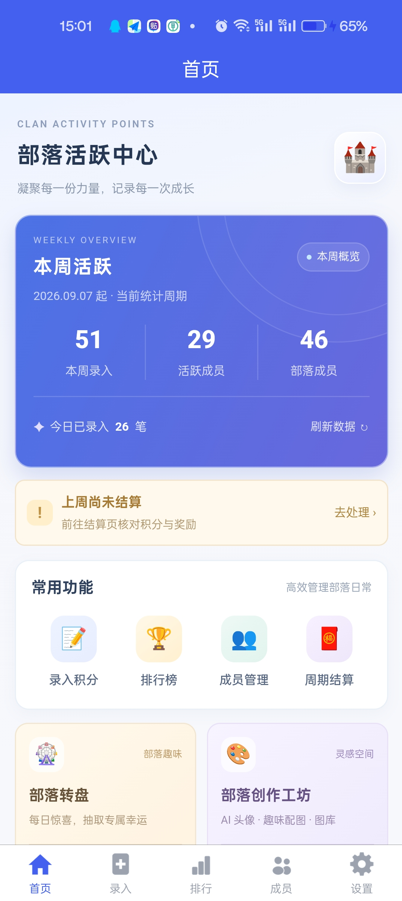
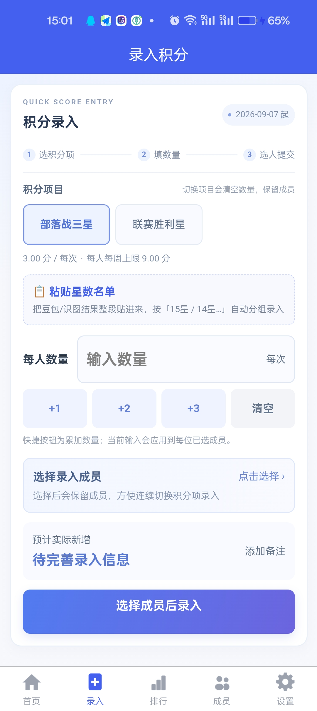
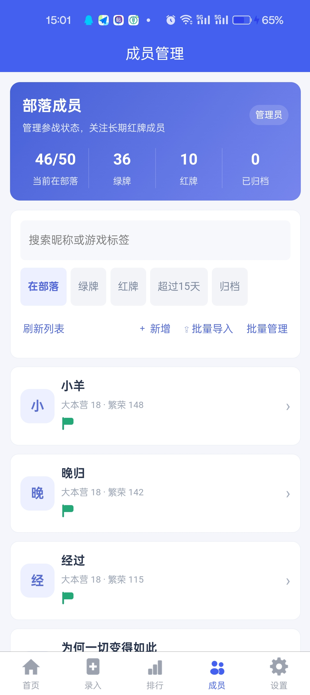
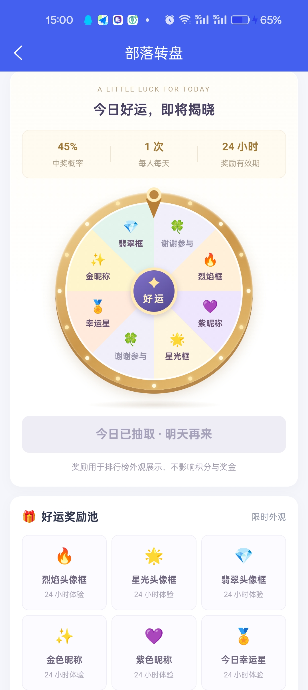
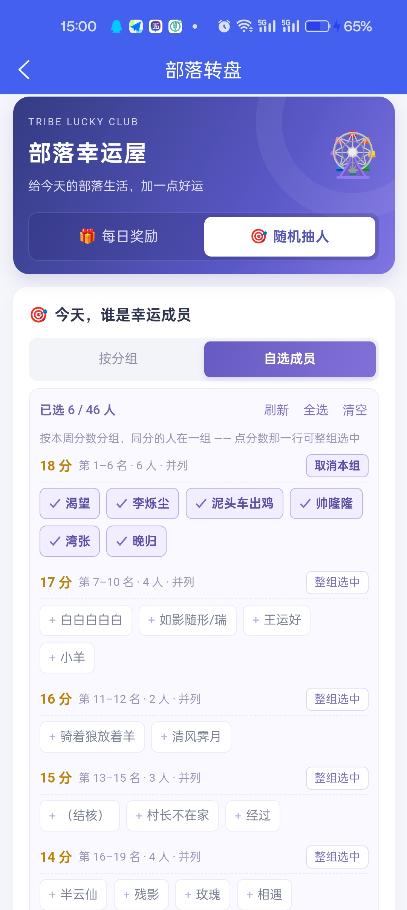
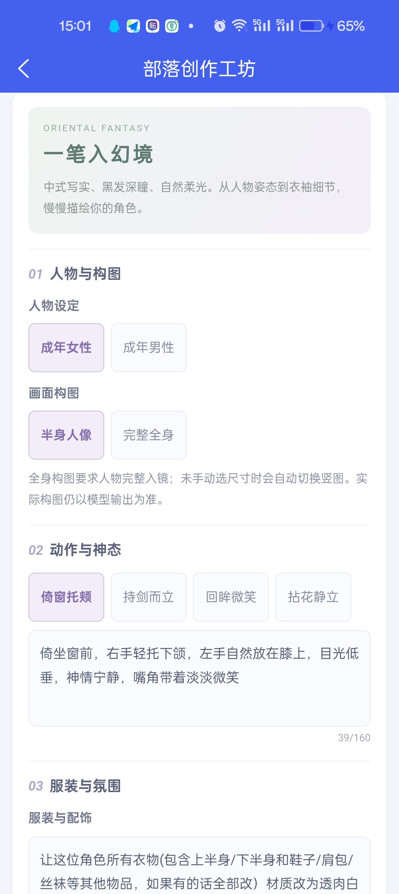
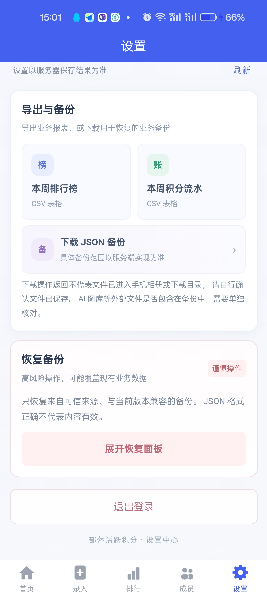

# 部落活跃积分管理 (coc-points)

面向 Clash of Clans 部落的一站式活跃积分工具：**快速录入 → 自动封顶计分 → 周/四周月/赛季结算与排名 → 红包发放 → 成员批量导入 → 幸运转盘**。

线上示例：<https://app.jiacheng.cyou>

一套代码两端可用：**H5 网页** 与 **原生 App**（uni-app / Vue3），App 打包产物直接指向后端接口，发给部落成员即可安装使用。

---

## 界面预览

| 首页 | 录入积分 | 成员管理 | 排行榜 |
|---|---|---|---|
|  |  |  |  |

| 部落转盘 · 每日奖励 | 部落转盘 · 随机抽人（自选成员） | 部落创作工坊（AI 绘画） | 设置与备份 |
|---|---|---|---|
|  |  |  |  |

> 最后两张里的「随机抽人 · 按本周分数分组」是给**每周奖励只有 1 份、但经常多人同分**这种情况用的：
> 同分的人自动归成一组，点分数那一行就能整组选中，再从中抽一个。

---

## 功能特性

| 模块 | 能力 |
|---|---|
| **首页** | 品牌头部 + **本周概览**（本周录入 / 活跃成员 / 部落成员 + 今日录入 + 刷新）+ 结算提醒 + **常用功能**（录入、排行、成员、结算、转盘、创作工坊）+ **本周前三**荣誉卡（金/银/铜 + 称号 + 总积分）+ 加载骨架与错误重试；**未登录时顶部显示只读提示与「管理员登录」入口** |
| **积分录入** | 手机端**紧凑操作面板**（规则 → 数量+快捷值 → 成员摘要 → 预览 → 确认，全在一张卡片内），成员列表**按需展开**；**实时预览"本次实际新增积分"**（按周上限截断后的真实增量，保存后由服务端 `total_delta` 复核）；保存后一键**撤销本批**；`client_token` 幂等 + 待确认批次可重试（双击/弱网重试不重复记账） |
| **排行榜** | 顶部「部落荣誉榜」氛围区 + 筛选卡（周榜 / 四周月、**综合榜 + 按规则自动生成的分项榜**、周期横向滑动、「在部落 / 含离开」）；列表带表头（排名 / 部落成员 / 贡献积分）、**前三金银铜高亮**、称号与限时外观、末行脚注；首次加载骨架、空态文案、点击行直达该成员明细 |
| **成员管理** | 绿牌 / 红牌 / 离开三态（CSS 旗帜 + 色点 + 搜索 + 6 个筛选）；**红牌计时**（服务端记 `red_since`，显示「已挂红牌 N 天」，超 15 天提醒，历史未知显示"待补录"）；**批量管理**（批量设绿/红/离开、批量追加备注、批量归档，幂等 + 整批成败）；**归档 = 软删除**（保留历史积分/结算/发奖）；**批量导入**（名单粘贴三步流程 / **游戏标签导入**：部落同步与按玩家标签查，官方 API） |
| **设置页** | 身份卡 + **三个面板**（奖励预算 / 积分规则 / 数据管理）：金额草稿校验与「整数分」估算、固定周一起点保护、规则**先编辑后创建**（不再一点击就写库）、启停以服务端结果为准、恢复备份需勾选 + 输入确认词且防重复提交 |
| **结算与红包** | 周 / 四周月 / 赛季结算快照（幂等）、冠军奖励、红包发放状态；已发放周期禁止撤销结算；已结算周禁止撤销录入 |
| **账号与权限** | **三级角色**：超级管理员（全部 + 账号管理 + 物理删除/备份恢复）/ 管理员（日常业务）/ 访客（只读，可选口令）；**匿名访客直接看首页**，无需任何密码；账号可停用、**删除（仅超管，需输入用户名二次确认）**、改密、强制退出，旧 Token 立即失效；成员内部备注不下发 |
| **幸运转盘** | 「部落幸运屋」视觉：金色外圈 + 环形灯珠 + 固定指针 + 独立中心徽章的转盘、奖项带图标；信息分层（代抽成员 / 抽奖舞台 / 当前闪耀外观 / 好运奖励池）；管理员**代抽并选择成员**，服务端按 **45%** 判定；奖励 24 小时有效（头像框 / 彩色昵称 / 称号），**同一成员每天一次**；「幸运点名台」随机抽人纯前端不写库、抽中后高亮 |
| **部落创作工坊** | 「轻量创作工作台」：渐变标题区 + **创作 / 本机图库 / 部落图库**三分区；**双卡片创作入口**（通用创作 / 东方幻境）；东方幻境的旧剧情导入默认折叠；提示词与参数、额度、任务状态分层呈现（**不显示虚假进度**）；作品双列卡片 + 深色大图预览；提示词 / 保存 / 上传 / 下载 / 删除与任务恢复逻辑不变；**风格提示词库**（内置 261 种手绘风格提示词，按 A–G 分类、**带参考图**、可按编号搜索，一键**填入本页**或**复制到其它 AI**） |
| **数据** | CSV 导出（排行 / 流水）、全量 JSON 备份与恢复、服务器每日 `mysqldump` 备份（保留 30 天） |

### 权限矩阵

（访客 = 登录了访客口令的只读身份；匿名访客与访客权限相同，且看不到成员备注）

| 功能 | 超级管理员 | 管理员 | 访客 / 匿名 |
|---|---:|---:|---:|
| 首页 / 排行榜 / 成员 / 流水 / 结算历史 | ✅ | ✅ | ✅ |
| 成员内部备注 `note` | ✅ | ✅ | ❌（服务端剥离） |
| 导出 CSV（本周排行 / 流水） | ✅ | ✅ | ❌ |
| **下载完整备份 / 恢复备份** | ✅ | ❌ | ❌ |
| **账号管理（新增 / 停用 / **删除** / 重置密码 / 强制退出）** | ✅ | ❌ | ❌ |
| **安全审计日志** | ✅ | ❌ | ❌ |
| **物理删除成员 `?purge=1`** | ✅ | ❌ | ❌ |
| 配置 / 预算 / 积分规则管理 | ✅ | ✅ | ❌ |
| 录入 / 撤销 / 成员增改归档 / 批量导入 / 结算 | ✅ | ✅ | ❌ |
| 转盘代抽 | ✅ | ✅ | ❌ |
| 转盘「随机抽人」（娱乐） | ✅ | ✅ | ✅ |

### 录入交互（手机端）

```
① 选积分项 → ② 填每人数量 → ③ 弹层批量选人 →「完成选择」→ 核对预览 → 提交
连续录入同一批成员：切积分项 → 输数量 → 提交        （成员保留）
更换成员：点成员摘要 → 弹层里点选 / 全选当前 / 只看已选 → 完成
```

- 面板顶部是 **QUICK SCORE ENTRY + 三步引导**（选积分项 / 填数量 / 选人提交），并显示当前周起始日。
- 积分项用**两行三列按钮**，一次点击切换；**切换积分项会清空数量**（避免把"捐兵 500"带进星数类规则）。
- **快捷数量来自后端配置**（`score_rules.quick_values`，设置页可编辑）：**不做任何隐式单位换算**，也不按规则名猜大数量；未配置时回退 `1 / 2 / 5`。
- **选人是弹层**（底部抽屉，不占主页高度）：即时点选（点一下即生效，"完成选择"只是收起）、两列卡片、搜索、绿/红牌筛选 + 每类人数、**全选当前 / 反选当前 / 只看已选**、底部固定"已选 N / 共 M"与"清空全部选择"（含被搜索隐藏的成员会二次确认）、一键复用"该积分项上次成功录入的成员"。
- 隐藏成员提示：另有 N 名已选成员不在当前筛选内，提交时仍会包含；打开弹层会清空上次的关键词与筛选，避免被旧条件困住。
- 成员区默认收起，只显示「已选 N 人 + 前 3 个名字」，点开才展开列表（≤50 人直接渲染，不再二次分页）；点「完成选择」回到录入面板。
- 预览显示「预计实际新增」，保存后以服务端返回的 **`total_delta`** 为准；请求结果不明确时会出现「上次提交结果尚未确认」，点**重试原批次**会复用同一 `client_token`，不会重复计分。
- 预览里还会提示「**N 人本周已录过这一项，本次分数会叠加（周上限内）**」——同一个人同一积分项在同一周重复录入是累加的（周上限封顶），这条提示就是提醒别再录一遍。

### 粘贴星数名单（识图结果批量录入）

录入手输的最大痛点是"同一批人星数不一样"：面板只能给所有人填同一个数量，`15星 / 14星 / 13星…`
得分十几次提交。这个功能把豆包/识图（OCR）结果**整段贴进来**，按星数分组、每组一个数量，
**一次成批**提交。

```
录入页 → 选积分项（如「联赛胜利星」）→ 点「📋 粘贴星数名单」→ 粘贴 → 解析名单
→ 核对每组名单（可指认/新建/忽略）→「应用分组 · N 人」→ 预览 → 确认分组录入
```

- **支持的文本**：`15星：帅隆隆、经过、晚归`（顿号/逗号/分号/竖线都可；没写分隔符时按空格切），
  全角数字、全角冒号、`15 颗`、`15星·` 前缀、markdown 标题行都能识别；解析不出的行会原样列在面板底部。
- **星数 = 每人数量**：15 星组按 15 记、6 星组按 6 记，互不影响；**0 星组不录入**（后端要求数量 > 0，0 星本来就是 0 分），面板会标注跳过人数。
- **名字匹配保守但有容错**（`app/src/utils/star-paste.js`）：
  - 精确匹配昵称（自动去掉全角/空格/`（）【】「」` 包裹，如 `（结核）` → 结核）或游戏标签；
  - 只差一个字且**整份名单里唯一**才自动采用（繁体 `經过` → `经过`、识图错字 `泥头车出鸡` → `泥头车出击`、`T0` → `T O`），并标「近似，请核对」；
  - 有多个候选 / 完全没匹配上 → 交给人工：**指认**（弹层里预填识图名字帮你找到近似候选）、**新建成员**、**忽略**；同一成员只能记一次，重复出现的那行会标「重复，已按 X 记一次」。
- **一次提交 = 一个批次**：提交体是 `entries:[{rule_id, quantity, member_ids}]`（每组一个数量），
  但**只有一个 `client_token`**，所以结果卡上的「撤销本批」会**一次性回滚所有组**；
  弱网重试/连点同一份名单也是幂等的（同批次号同成员不会重复记分）。
- **录错了怎么办**：点「撤销本批」→ 重新粘贴/修正 → 再提交（撤销后才允许重录；直接重复导入会与原批次叠加并被周上限截断）。
- 提交成功后自动退出分组模式并清空名单，避免同一份名单被再点一次。
- **快速切换**：和自动匹配同一尺度（归一化后只差一个字以内）的其它成员会以小标签列在那一行下面，点一下就换（例如名单里的 `天下` ↔ `天谴`）；差得远的不列，避免"2 字昵称人人相似"的噪音，那种情况用「指认」（弹层里搜索框已预填识图名字）。
- **弹层层级 + 底边**（两处都踩过坑）：页面内容 < 粘贴面板 `850` < 选人弹层（含指认模式）`900` < **tabBar `998`** < uni 内置弹窗 `999`。
  - uni-app H5 的 `uni.showModal`/`uni.showToast` 固定在 `999`，所以弹层必须低于它，否则「清空全部选择」这类确认框会被弹层盖住；
  - tabBar 是 `998`，而 `998` 与 `999` 之间没有整数 —— 抢不过就会把抽屉底部的确认按钮压掉。所以弹层**不去跟 tabBar 抢层级**，而是整体停在导航栏之上：`bottom: var(--window-bottom, 0px)`（uni 写在 `<html>` 上的 tabBar 高度 + 底部安全区），页脚也不再重复加 `env(safe-area-inset-bottom)`。
- 实测（线上真实名单 46 人，用户提供的那份识图结果）：30 个名字 → 26 个精确 + 3 个近似（`經过`/`泥头车出鸡`/`T0`）+ 1 个 0 星跳过，**28 人 / 10 组 / 一次提交**。
- 顺带修掉一个老 bug：`GET /api/options` 之前**不返回成员的 `tag`**，导致选人弹层里每个人的「游戏标签」永远显示"未设置游戏标签"、按标签搜索也搜不到；现在 46 名成员的标签都能正常展示与搜索（与公开成员列表口径一致）。

### 账号与登录（三级角色）

```
匿名访客：打开网站 -> 直接进首页，无需任何密码（只读公开数据）
管理员  ：设置页 / 首页入口 -> 登录页（用户名 + 密码）-> 登录后可管理
超级管理员：登录后额外拥有「管理员管理」入口与备份/恢复/物理删除权限
```

- 角色：`super_admin`（超级管理员，只允许一个）/ `admin`（管理员）/ `viewer`（访客口令，可选）/ 匿名 `guest`。
- **账号在数据库里**（`users` 表，密码用 Node 内置 scrypt 加盐哈希），不再有共享 `ADMIN_PASSWORD`；首次初始化与忘记密码都在服务器本地执行：
  `npm run user:init-super-admin`、`npm run user:reset-password -- <用户名>`、`npm run user:list`。
- **可即时吊销**：JWT 带 `sub`（账号 ID）与 `ver`（token_version），每次请求都核对账号是否启用与版本；改密、重置密码、停用、强制退出都会让旧 Token 立刻失效。
- **临时密码**：超管创建账号/重置密码会得到一次性临时密码（页面提供**复制按钮**，也可长按选中），该账号首次登录必须先改密才能使用业务功能（服务端强制 403 `MUST_CHANGE_PASSWORD`）。
- **匿名只读范围**：首页、排行榜、成员列表（不含内部备注）、积分流水、结算历史、转盘状态、公开规则；管理配置（`/api/settings`、`/api/budget`）、导出、备份、恢复与所有写接口都要求登录（匿名 401 / 访客 403）。
- 账号管理页（仅超管）：新增账号、改显示名、停用/启用、**删除账号**（仅普通管理员；弹窗里输入用户名才可确认，超级管理员账号不可删除，避免把自己锁在外面）、重置密码（一次性临时密码 + 复制按钮）、强制退出，并查看安全审计日志。
- **删除账号不影响追溯**：安全审计表存的是「用户名快照」而不是外键，所以账号删掉后，它历史上的登录/操作日志仍然完整可查，只是账号本身不可恢复（命令行兜底：`npm run user:delete -- <用户名> --yes`）。

### 设置页（管理员 / 访客）

```
身份卡 → 奖励预算 | 积分规则 | 数据管理   （三个面板切换，未保存/编辑中会显示小圆点）
奖励预算: 三项金额 → 草稿估算(12周赛季) → 保存(二次确认) → 服务器预算与已发放
积分规则: 搜索 → ＋新增/编辑（独立编辑面板）→ 规则卡片（启用状态按钮 + 编辑）
数据管理: 导出 CSV / 下载 JSON 备份 → 危险区「恢复备份」（勾选 + 输入"恢复备份" + 最终确认）
```

- 未登录/访客只看到身份卡、账号入口与权限说明，且**不请求** `/api/settings`、`/api/budget`（服务端同样 401/403）；登录后同一页多出「账号与安全」（改密、超管的账号管理入口）。
- **周期起点固定周一**：后端 `week_start_day` 为 `1`；若服务端返回其它值，页面会提示并**停用保存**，避免改动历史周归属。
- 金额用「整数分」做草稿估算，避免浮点误差；规则分值/上限按数据库 `DECIMAL(10,2)` 校验（整数最多 8 位、最多两位小数），**上限留空 = 不限，填 0 = 上限 0 分**。
- 规则启停改用受控状态按钮：**服务端成功后才改界面**；新增规则先填表、校验、确认再入库（同名由服务端返回 409）。
- 恢复备份：勾选风险确认 + 输入确认词才可提交，全局操作锁防重复提交；成功后清空本地登录并回到登录页。

### 批量导入（两种方式）

页面顶部切换导入方式，两种方式互不影响：

```
方式一 名单粘贴：① 粘贴名单 → ② 预览解析（分类统计 + 成员卡片）→ ③ 确认导入
方式二 游戏标签导入：部落同步（整部落比对）/ 按标签导入（粘贴 #标签 逐个查）
```

- **格式说明可折叠**：识图格式 `名称,大本营,牌子,繁荣度`（如 `清风霁月,14,绿,63`）/ 昵称 / `昵称,#标签` / `昵称,#标签,备注`，Excel 直接粘贴（制表符、中英文逗号都可）；实时显示已输入字符数与行数。
  - 识别规则：第 2 列是**正整数**（大本营等级）**且**第 3 列是绿/红 → 按识图格式解析（牌子直接映射 `members.status`：绿=0 / 红=1）；否则按旧格式（第 2 列当标签）。大本营填 0、繁荣度非数字或负数都会报「第 N 行: …」。
  - **大本营与繁荣度都不设上限**（初版按 1-16 与 0-1000000 校验，游戏继续开新本、繁荣度继续涨之后就过时了 —— 上限已删掉，只校验下界；数据库列也放宽到 `town_hall TINYINT UNSIGNED` / `prosperity INT UNSIGNED`，迁移 009）。
- **预览分类**：新增 / 恢复 / 已存在 / 同名冲突 / **牌子变化** / **资料变化** / 错误·重复；错误行原样展示服务端的「第 N 行: 原因」；新成员列表默认显示 10 人，可展开全部。
- **重名 = 更新，不是重复建人**：带上资料的重复行会跟库内比对，牌子变了进「牌子变化」（显出 `绿牌 → 红牌`、`大本营 14 → 16`），只有大本营/繁荣度变了进「资料变化」；确认页两组**默认勾选**，可以分别取消（取消就不写库）。牌子变化写审计日志（`批量导入改牌子`），并把 red_since 按服务端口径记成当天 / 清空。
- **50 人是软提醒**：`导入后在部落人数 X / 50` 超限时红色提示 + 二次确认，**不硬拦**（历史数据可能已超），服务端同样只返回 `warning`。
- **同名冲突**：只贴昵称（没有资料）的重复行，仍按旧口径判为「同名冲突」并跳过（分不清是不是同一个人）；勾选「允许同名但标签不同的成员同时存在」后重新预览才会按新成员导入。
- **重复提交安全**：同一份名单再提交不会重复建人、也不会重复改牌子 —— 带标签的行命中 `exists`、刚导过的识图行会变成「与库内一致」，弱网重试/连点都不会翻倍；导入成功后自动返回成员页（该页 `onShow` 会刷新列表）。
- **游戏标签导入（官方 API）**：先保存**部落标签**（存 `settings.coc_clan_tag`），再「读取游戏数据」得到差异报告并按分组勾选应用；
  - 分组：**新增成员**（默认勾选）/ **补改游戏标签** / **状态变化**（绿↔红、回到部落）/ **建议记为离开**；
  - 按钮语义：「导入新增成员」= 服务端重拉官方名单、**只自动新增**（`auto_add:true`）；「应用勾选项」= 只提交你勾选的状态/标签/离开动作；
  - 「按标签导入」粘贴游戏内复制的 `#标签`（单次 ≤30 个），返回昵称 / 大本 / 战意 / 是否在本部落 / 本地匹配与建议动作，可批量勾选导入；
  - 打 `#` 的标签按宽松规则识别；不打 `#` 的必须符合官方标签字符集，否则会在界面上列为「无法识别」，避免把备注文字当标签。
- 访客进入本页会被 `ensureAdminPage()` 拦下并提示只读，服务端相关接口对访客均 403。

### 成员管理（状态 / 红牌计时 / 批量操作）

```
概览(在部落/绿牌/红牌) → 超期横幅 → 搜索 + 筛选(在部落/绿牌/红牌/超过15天/离开/全部)
单成员: 点卡片 → 编辑资料 / 补录红牌开始日期 / 移除并归档
批量: 「批量管理」→ 全选当前 / 反选 → 设绿牌 / 设红牌 / 设离开 / 追加备注 / 归档
```

- **旗帜用 CSS 绘制**（不依赖 Emoji 平台差异）：绿旗=绿牌、红旗=红牌、灰点=离开；红牌显示「已挂红牌 N 天」，`> 15` 天加橙红提醒条。
- **列表次行显示「大本营 14 · 繁荣 63」**（原先是游戏标签），并**默认按繁荣度降序**排列（没有繁荣度的排最后）；繁荣度相同或都为空时，超期红牌优先、再按昵称。搜索支持昵称/标签，纯数字关键词按大本营等级或繁荣度**精确**匹配（输入 `14` 能找到大本营 14 的成员）。数据来自识图导入，也可以在成员编辑页手填。
- **红牌计时由服务端管**：绿→红记开始日期；红→红**不重置**；红→绿/离开结束计时；再挂红牌重新计时。历史红牌没有开始时间时显示「红牌时间待补录」，**不会编造 0 天**；补录走独立接口（写审计日志，普通保存不碰计时）。
- **批量操作是整批成败**：带 `client_token` 幂等——同批次号同内容返回原结果（`duplicated`），换了内容返回 **409**；追加备注按原备注 `| ` 拼接且先校验长度，连点/弱网重试**不会重复追加**；单批最多 200 人。
- **归档代替删除**：`deleted_at` 置位 + 状态改离开 + 结束红牌计时，**不删除积分/结算/发奖记录**；默认列表、录入候选、排行榜都不再出现，需要时可用「全部」筛选或 `?include_archived=1` 查看；批量转绿/红牌即可**重新激活**归档成员。
- **50 人上限保护**：把成员转回绿牌/红牌时，若在部落人数**将超过** 50 人，批量与单人操作都会被拒（409，不写一半）；恰好 49→50 允许。

---

## 技术栈

- **后端**：Node.js 18+ + Express + mysql2（MySQL 8），JWT 双角色认证
- **前端**：uni-app (Vue3 + Vite)，H5 优先，可扩展微信小程序 / Android
- **部署**：阿里云 ECS（宝塔面板 nginx）+ systemd + HTTPS(certbot) + crontab 备份

---

## 目录结构

```
Blct/
├── server/                     # 后端
│   ├── schema.sql              # 新装环境的完整建库脚本
│   ├── migrations/             # 增量迁移（生产升级只跑这里）
│   │   ├── 001_member_status_semantics.sql   # 成员三态语义(仅注释)
│   │   ├── 002_record_idempotency.sql        # 录入幂等令牌
│   │   └── 003_wheel.sql                     # 转盘抽奖 + 限时外观
│   ├── scripts/
│   │   ├── test-cycle.mjs      # 周期计算单元测试
│   │   ├── e2e-run.mjs         # E2E 编排器(起 MySQL → 建库 → 起后端 → 跑断言)
│   │   └── e2e-cases.mjs       # 419 条端到端断言
│   └── src/
│       ├── lib/                # cycle 周期 / calc 封顶计分 / wheel 转盘 / auth 认证 / settings 种子
│       ├── routes/             # auth admin-users members rules records ranking settle data meta wheel
│       ├── app.js
│       └── server.js
├── app/                        # uni-app 前端
│   └── src/
│       ├── pages/              # index entry ranking members member-edit member-import settings login change-password admin-users wheel settle records workshop
│       │                       # settings settle records login wheel
│       ├── static/tabbar/      # 5 组(常态/选中) tabBar 图标
│       └── utils/              # api 请求+角色 / navigation 统一跳转 / permissions 只读
│                               # h5 宿主标题 / cosmetics 限时外观 / star-paste 星数名单解析匹配
└── deploy/                     # 部署交付
    ├── DEPLOY.md               # 部署手册(含宝塔环境实测记录与三个批次变更说明)
    ├── coc-points.nginx.conf   # 站点示例(宝塔环境实际路径见 DEPLOY.md)
    ├── coc-points.service      # systemd 单元
    └── backup.sh               # 每日 mysqldump 备份
```

---

## 核心规则

- **周期**：周 = 7 天、月 = **连续 4 周**（不是自然月，前端显示为「四周月」）、赛季 = 连续 12 周；三者与「周一」及项目既有锚点（2024-01-01）严格对齐。
- **计分**：`某周某规则积分 = min(数量合计 × 单位分值, 周上限)`，再跨周累加；无上限规则按实际累计。
  **积分不落库**：排行榜/仪表盘/导出/预览每次都按同一口径实时聚合，因此撤销录入只需删除记录，各周期口径自动回到正确值。
- **撤销保护**：已生成结算快照的周**不允许**撤销录入（返回 409，需先撤销结算）；已发放红包的周期不允许撤销结算。
- **服务端二次校验**：录入时服务端独立校验「规则存在且启用 / 数量为正 / 成员存在且未离开」，前端预览只作展示；`POST /api/records` 返回的 `total_delta` 是**服务端在事务内按提交前后封顶差值算出的真实新增积分**，不采用客户端预览值；同一 `client_token` 若被换成不同内容直接 **409**（防止"撤销本批"误删其它记录）。
- **成员三态**：`0 部落战绿牌` / `1 部落战红牌`（正常计分）/ `2 离开`（不计入人数、录入候选与默认排行，但历史保留）。
- **官方 API 成员同步（只读预览 + 勾选应用；新增自动、状态人工）**：`GET /api/coc/status` → `POST /api/coc/preview`（必要时 `{no_cache:true}`）→ 前端/CLI 勾选要应用的条目 → `POST /api/coc/apply`。另有一条**按玩家标签查**的入口 `POST /api/coc/lookup`（粘贴 `#标签` → 返回昵称/大本/战意/是否在本部落 + 与本地库的匹配与建议动作，同样只读）。
  ⚠️ **只覆盖全球服（国际版）**：2022 年起 COC 中外分服，国服（腾讯版）是**独立服务器/独立数据**，`api.clashofclans.com` 查不到国服部落 → **本项目（国服）实际走的是「名单粘贴」导入**，官方同步能力保留在代码里但未启用（详见 `deploy/DEPLOY.md` 的「官方 API 成员同步」结论）。
  能自动拿到：**成员名单**（谁在部落，据此判定"在部落/已离开"）、**每个成员的 `warPreference`（`in`=绿牌 / `out`=红牌）**、成员角色/大本/奖杯/捐兵、当前部落战的参战名单与每人出手星数。
  注意：**战意字段只在 `/players/{tag}` 返回**，成员名单接口没有 → 一次同步 = 1 次部落请求 + 每人 1 次玩家请求（约 8 req/s 节流，官方响应有 10 分钟缓存）。
  拿不到：离开时间、内部备注、战意变更历史（靠两次快照对比）。
  **产品口径**：`POST /api/coc/apply` 支持 `auto_add:true`——服务端自己重拉官方名单，**只自动"新增成员"**；绿牌/红牌/离开/补标签等一律由前端勾选后显式放进 `actions` 才写库。
- **红牌计时**：`members.red_since` 记本次红牌开始的**业务日期**，`red_days` 由服务端算（当天=0，历史未知=`null`）；`red_days > 15` 为超期；绿牌/离开为 `NULL`。规则集中在 `server/src/lib/member-status.js`，单人编辑、批量操作、导入恢复、归档都复用同一函数。
- **归档（软删除）**：`members.deleted_at` 有值即归档——状态置离开、结束红牌计时、默认列表/录入候选/排行都不返回，但积分流水、结算快照、红包记录**全部保留**；物理删除只在 `DELETE /api/members/:id?purge=1`（管理员显式指定）。
- **50 人上限**：`POST /api/members/batch-action` 与 `PUT /api/members/:id` 在"转回绿牌/红牌会使在部落人数超过 50"时整批/单人拒绝（409）；批量导入仍是**软提醒**（对齐游戏上限，不硬拦历史超限数据）。
- **奖励默认**（可在设置改）：周奖第 1 名 6 元 / 四周月奖第 1 名 12 元 / 赛季奖第 1 名 12 元 → 一个 12 周赛季预算 **120 元**。
- **转盘**：中奖率 45%（服务端判定，扇区仅展示）；奖励 24 小时有效、不影响积分/名次/红包；同一成员每天一次，且不会重复领到仍在生效的同款外观。

---

## 本地开发

### 本地要连哪份数据？先分清三件事

| 场景 | 接口地址从哪来 | 数据从哪来 |
|---|---|---|
| 改代码实时调试（`npm run dev:h5`） | 同源 `/api`，由 vite dev server 代理 | **本机后端**（默认 `127.0.0.1:3000`）→ 本地开发库 |
| 线上正式站 | 同源 `/api`，由 nginx 反代 | 服务器本机后端 → 生产库 |
| 打包产物放到**别的域名/机器** | 构建时写死的绝对地址 `VITE_API_BASE` | 目标后端 |

⚠️ **打包后的 H5 是纯静态文件，没有代理层**：产物里 `BASE = '/api'` 是相对路径，谁托管它就打给谁。
所以"本地起个静态服务器打开打包产物，想看线上数据"是**做不到**的，必须二选一：

- 构建时指定后端绝对地址：`VITE_API_BASE=https://app.jiacheng.cyou npm run build:h5`，
  **并且**后端要放开跨域 `CORS_ORIGINS`（否则浏览器直接拦）；或
- 用一个带 `/api` 代理的静态服务器托管产物（同源，不需要 CORS）。

### 三步跑起来

```bash
# 1) 本地开发库：独立 MySQL 实例(端口 33306, 数据目录 .dev-mysql), 首次自动建库
cd server && npm install && npm run dev:db        # 前台常驻, Ctrl+C 停止

# 2) 后端（另开一个终端）
cd server && npm run dev                          # http://127.0.0.1:3000

# 3) 前端（再开一个终端）
cd app && npm install && npm run dev:h5           # http://127.0.0.1:5173, /api 代理到 3000
```

`server/.env` 里 `DB_PORT` 必须等于 `dev:db` 用的端口（默认 33306，见 `server/.env.dev-db`）。
不用本机 3306 那个 MySQL 服务，是为了不跟你机器上其它项目的数据混在一起。

### 把生产数据拉到本地（只读，不动线上）

```bash
cd server
npm run db:pull          # 生产 mysqldump(只读) → 下载 → 覆盖导入本地开发库
npm run db:pull -- --ai  # 顺带把 AI 工坊图库文件也拉下来
npm run dev:db:reset     # 也可以只重建本地库(重新导入已有快照)
```

快照落在 `.e2e-logs/dev-seed/`（已在 `.gitignore` 内）。**它含 `users` 表的密码哈希**，
所以本地库里的账号密码与线上完全一致（直接用你的真实账号登录即可），但这份文件不要外传。

### 接口地址与跨域（跨域部署时才需要）

```bash
# 前端：把接口指到某个后端(只写域名即可, 自动补 /api)
cd app
VITE_API_BASE=https://app.jiacheng.cyou npm run build:h5     # bash
$env:VITE_API_BASE='https://app.jiacheng.cyou'; npm run build:h5   # PowerShell

# 后端：放开跨域(留空=关闭, 同源部署不需要)
#   server/.env
CORS_ORIGINS=https://你的前端域名,http://localhost:8080
CORS_ORIGINS=*        # 任意来源(本项目用 Authorization 头鉴权, 不用 Cookie)
```

`.env` 可从 `server/.env.example` 复制，关键项：

```
DB_HOST / DB_PORT / DB_USER / DB_PASSWORD / DB_NAME
JWT_SECRET=openssl rand -hex 32
# 管理员账号不再用环境变量: 存在数据库 users 表(scrypt 哈希)
#   初始化: npm run user:init-super-admin        (服务器本地, 交互式输入密码)
#   重置:   npm run user:reset-password -- <用户名>
VIEWER_PASSWORD=访客口令(可选, 留空则关闭访客口令登录; 匿名访客默认可只读浏览)
COC_API_TOKEN=部落冲突官方 API key(可选, 留空=关闭游戏内成员同步; 需把服务器出网 IP 加进 key 的允许列表)
CORS_ORIGINS=跨域白名单(可选, 留空=关闭; 仅当 H5 与后端不同源时才需要)
```

> 前端的接口地址只有**一个来源**：`app/src/utils/api-base.js` 导出的 `API_BASE`
> （`api.js` 与 `workshop-api.js` 都 import 它），值由 `app/vite.config.js` 在构建期注入。
> 不要在页面里另写 `'/api/...'` 字面量。

### 打包 App 发给别人（不需要 CORS）

**先记住一句话：CORS 是浏览器的机制。**原生 App 走的是系统网络栈，没有"页面来源"，
也就不存在同源策略，所以**后端一行都不用改**。

```bash
cd app
npm run build:app        # 产物在 app/dist/build/app
```

- 非 H5 平台（App / 小程序）**默认就用生产后端** `https://app.jiacheng.cyou/api`，
  不用手动配环境变量；想指到别的后端才设 `VITE_API_BASE`。
- **护栏**：非 H5 平台如果最终算出的是相对地址（如 `/api`），构建会**直接失败**并提示，
  而不是打出一个"装上就没数据"的哑巴包。
- 打包时会打印一行 `[api-base] platform=app base=https://…`，出包前扫一眼就知道连的是哪个后端。

App 与 H5 的能力差异（`workshop-api.js` / `api.js` 里是 H5 专属实现）：

| 功能 | App | H5 |
|---|---|---|
| 首页/录入/排行/成员/设置/转盘/结算/流水/批量导入 | ✅ | ✅ |
| AI 创作工坊（生图） | ❌ 入口在非 H5 已隐藏（依赖 `fetch`/`Blob`/`FormData`/`canvas`） | ✅ |
| 导出 CSV / 备份 JSON | ❌ 提示"请用电脑浏览器打开" | ✅ |

出 APK/IPA：`dist/build/app` 是**资源包**，不是安装包。用 HBuilderX
「文件 → 导入 → 从本地目录导入」选它，然后「发行 → 原生App-云打包」，
需要登录 DCloud 账号（Android 可用公共测试证书，iOS 需 Apple 开发者证书）。
装到手机上验证时重点看：能不能登录、首页有没有数据（即接口地址是否生效）、
以及底部 tabBar 与安全区。**本项目尚未做过真机验证。**

> App 与 H5 分发的一个关键差别：App 是**直连线上 API** 的，后端改了数据或逻辑，
> 已发出去的 App **不用重新打包**（除非改了前端代码）。

---

## 测试

```bash
cd server

# 1) 周期计算单元测试（不需要数据库）
npm test

# 2) 真实 MySQL 端到端测试：自动起独立 MySQL 实例 → 建库 → 起真实后端 → 跑 HTTP 断言
#    覆盖: 鉴权/限流/成员三态/规则/录入封顶/预览/幂等/撤销/粘贴星数分组录入(entries)/
#          分项榜/结算/红包/导出/备份恢复/访客 403/转盘(含访客代抽)/永久删除/识图导入  共 452 条断言
npm run test:e2e

# 3) 官方 API 同步: E2E 会起一个本地"官方 API 桩服务"(scripts/coc-stub.mjs),
#    后端通过 COC_API_BASE 指向它, 覆盖 预览差异/按标签查询/自动新增/幂等/审计/权限/官方报错 等 36 条断言
#    (本地沙箱连不通 api.clashofclans.com, 真实联调请在服务器上跑 scripts/coc-sync.mjs)

# 4) 前端页面"空数据渲染"检查(不需要浏览器): 用各页 data() 的初始值渲染模板,
#    抓出"在 null 上取属性"这类只在浏览器控制台才暴露的渲染期异常
node ../tools/page-null-render.mjs ../app/src/pages/*/*.vue
```

### 前端逻辑的本地验证（不需要浏览器）

```bash
# 5) 粘贴星数解析器: 用线上真实成员名单 + 用户那份识图原文跑 59 条断言
#    (精确/繁体/错字/括号/0星/重复/多候选/全角数字/空格分隔/快速切换候选 等)
node tools/star-paste-check.mjs

# 6) 录入页「粘贴星数名单」页面级流程: 编译 + 真渲染(完整响应式) + 请求桩, 共 110 条
#    断言 解析→分组→提交体(entries+单批次号)→保存后复位→指认/新建/忽略/快速切换
#         →面板渲染→弹层层级与底边(z-index/tabBar 让位)→普通录入不受影响
node tools/entry-paste-flow.mjs

# 7) 批量导入页(识图格式)页面级流程: 共 21 条
#    断言 预览分类→默认勾选→取消勾选后有效条数→apply 提交体→无变更时禁止导入
node tools/import-page-flow.mjs

# 8) 打包产物的接口基址注入: 校验 VITE_API_BASE 是否按预期进了产物
node tools/check-api-base.mjs app/dist/build/h5 /api

# 9) 成员页「归档」筛选 + 归档成员可查看/可恢复: 84 + 30 条
#    断言 请求带 include_archived=1 / 归档成员留在列表 / 各筛选分流且并集覆盖全部成员 /
#         「已归档」标签与日期渲染 / 不可重复归档 / 恢复按钮只对归档成员生效(提交体与提示文案) /
#         管理员可见 新增·批量导入·批量管理, 访客只见"只读模式+管理员登录"
node tools/members-archive-flow.mjs
node tools/member-edit-archive-flow.mjs

# 10) 打包产物内容核对(该在的在、旧代码必须 0 处)
node tools/check-app-bundle.mjs app/dist/build/app

# 11) 运行中的 dev server 能否正常编译改动后的页面(需要 npm run dev:h5 在跑)
node tools/dev-server-page-check.mjs http://localhost:5173 /src/pages/members/members.vue

# 12) 模板静态规则: 不允许出现不带指令的裸 <block>
#     (H5 编译器会把它编译成真实 <template>, 而 <template> 的子节点是惰性内容 → 整块不渲染)
node tools/check-block-usage.mjs

# 13) 创作工坊 App 适配层: 按 App 的条件编译剥一遍源码, 再用内存文件系统跑通
#     取图 → 存本机 → 列表 → 上传 → 存相册 → 删除(重点验 uni.saveFile 的"移动"语义)  61 条
node tools/workshop-app-flow.mjs

# 14) 东方幻境: 不点「整理提示词」直接自己写也能生成 + 默认服装  32 条
node tools/workshop-oriental-flow.mjs

# 15) 转盘: 访客也能领每日奖励(只读门禁删干净)  21 条
node tools/wheel-guest-flow.mjs

# 16) 转盘随机抽人「自选成员」: 按本周分数分组 / 整组选中 / 只从勾选名单里抽  77 条
node tools/wheel-fun-pick-flow.mjs

# 17) 真浏览器巡检(需要 dev server 在跑; 断言 DOM 里没有真实 <template>、节点数达标、关键文案可见)  28 条
node tools/browser-page-check.mjs http://localhost:5173

# 18) 真浏览器 + 真点击: 切「随机抽人」→「自选成员」→ 点分数整组选中, 断言计数/按钮/无横向溢出  18 条
node tools/wheel-fun-ui-check.mjs http://localhost:5173

# 19) 工坊「风格提示词库」(handraw-style 261 种手绘风格 / A–G 分类): 数据完整性 + 备好提示词 +
#     过滤与文案 + 页面接线(分类短名/分批渲染/填入要确认/复制反馈/参考图/点 ✎ 粘贴剪贴板)  230 条
node tools/handraw-library-flow.mjs

# 20) 真浏览器 + 真点击 + 真键盘输入: 开「风格提示词库」→ 输入 041 → 切分类 → 继续显示 →
#     复制(提示是否真在屏幕最上层 + 把剪贴板读回来核对) → 点参考图看大图 →
#     填入提示词(断言正好等于备好的那条) → 点 ✎ 用剪贴板内容替换描述  47 条
node tools/handraw-library-ui-check.mjs http://localhost:5173

# 21) 风格库数据/参考图/备好提示词的上游更新(需要先把上游仓库 clone 到本地)
# git clone --depth 1 https://github.com/yang0/handraw-style /tmp/handraw-style
# node tools/generate-handraw-styles.mjs /tmp/handraw-style   # 261 条文字数据
# node tools/build-handraw-thumbs.mjs /tmp/handraw-style      # 261 张参考图缩略图(.gitignore 排除)
node tools/generate-handraw-prompts.mjs                       # 261 条备好提示词(规则拼装, 不需要上游)
```

> 完整的工具清单与各自的依赖（要不要数据库/浏览器/dev server）见 **[tools/README.md](tools/README.md)**。

> 发布前审计：`node tools/audit-for-publish.mjs` —— 只扫 **git 会提交的文件**，检查有没有密钥、口令、
> 私钥、内网/公网 IP 混进仓库（结果只报位置，不打印值）。

> `entry-paste-flow.mjs` 用 `createRenderer` 配一套极简节点操作真渲染页面（**不用 SSR**：
> SSR 渲染后的实例 computed 不再失效重算，会让断言看到过期值）。它验证的是"页面胶水"：
> 解析结果怎么进 computed、`/api/records` 到底收到什么 body、保存成功后状态怎么复位——
> 这些既不在纯函数单测里，也不在服务端 E2E 里。

> **为什么需要第 3 项**：`v-show` **不阻止渲染**。如果写成
> `<view v-show="step === 2 && preview">` 而里面引用了 `preview.counts`，在 `preview` 还是 `null` 的首次渲染时
> 就会抛 `Cannot read properties of null (reading 'counts')`（成员批量导入页曾因此报错，已改 `v-if`）。
> 打包构建、静态类型检查和 E2E 都发现不了这类问题，必须在"数据未就绪"的状态下真正跑一次渲染函数。

> E2E 使用独立数据目录与独立端口（默认 33307 / 3199），**不会**接触开发库或生产库。
> 环境变量：`E2E_MYSQLD`（mysqld 路径）、`E2E_MYSQL_PORT`、`E2E_API_PORT`。

---

## 生产部署

完整步骤与实测记录见 **[`deploy/DEPLOY.md`](deploy/DEPLOY.md)**，要点：

- 后端 `/opt/coc-points/server`（systemd 单元 `coc-points`），前端静态 `/var/www/coc-points/h5`。
- 生产库结构变更**只跑 `server/migrations/*.sql` 增量脚本**，不要重跑 `schema.sql`。
- 实测服务器为**宝塔面板环境**：nginx 为 `/www/server/nginx/sbin/nginx`，站点配置在 `/www/server/panel/vhost/nginx/*.conf`（不是 `/etc/nginx`）；改动后用 `kill -HUP $(cat /www/server/nginx/logs/nginx.pid)` 平滑重载。
- 每日备份 `/opt/coc-points/backup.sh` + crontab `0 3 * * *`，产物 `/var/backups/coc-points/`（保留 30 天）。

---

## API 概览

> 除 `/api/health`、`/api/auth/login` 外均需 `Authorization: Bearer <token>`；
> **公开只读**：匿名访客可读首页/排行/成员/流水等业务数据（成员备注除外）。
> **所有非 GET 请求要求管理员**（匿名返回 401，访客口令返回 403）。
> **不可逆操作限超级管理员**：`POST /api/restore`、`DELETE /api/members/:id?purge=1`、`/api/admin/*`。

| 方法 | 路径 | 说明 | 权限 |
|---|---|---|---|
| POST | `/api/auth/login` | 登录（返回 `token` + `role`） | 公开 |
| GET | `/api/auth/me` | 当前身份与 `can_write` | 登录 |
| GET/POST/PATCH/DELETE | `/api/admin/users` | 账号管理：新增 / 改显示名 / 停用·启用 / **删除**（仅普通管理员，超管账号不可删）/ 重置密码 / 强制退出 | 超管 |
| GET | `/api/dashboard` | 仪表盘（本周录入/活跃/人数/前三） | 登录 |
| GET/POST/PUT/DELETE | `/api/members` | 成员管理（三态 + `red_since`/`red_days`/`deleted_at`；列表默认排除归档，`?include_archived=1` 全查；**DELETE 默认=归档**，`?purge=1` 才物理删除） | 读 / 管理员写 |
| PUT | `/api/members/:id/red-since` | 补录红牌开始日期（仅当前红牌；禁未来日期；写审计日志） | 管理员 |
| POST | `/api/members/batch-action` | 批量改状态 / 追加备注 / 归档（`client_token` 幂等、整批成败、单批 ≤200、50 人上限保护） | 管理员 |
| GET | `/api/coc/status` | 官方 API 同步配置状态（是否配了 token / 部落标签 / 本地在部落人数） | 管理员 |
| POST | `/api/coc/preview` | **拉官方数据 + 与本地库对比**，返回差异报告（新增 / 状态变化 / 标签待补 / 离开建议）；`{no_cache:true}` 跳过 10 分钟缓存；**不写库** | 管理员 |
| POST | `/api/coc/lookup` | **按玩家标签查**（`{text:'#AAA111 #BBB222'}` 或 `{tags:[...]}`，单次 ≤30 个）：返回昵称/大本/战意/是否在本部落 + 与本地库匹配与建议动作；**不写库** | 管理员 |
| POST | `/api/coc/apply` | 只应用请求里显式列出的 `actions`（新增 / 补标签 / 改状态 / 记离开），幂等 + 写审计；`{auto_add:true}` 时**只**自动新增官方名单里的新面孔 | 管理员 |
| POST | `/api/members/batch/preview` | 批量导入预览（分类：新增/恢复/已存在/待确认/错误） | 管理员 |
| POST | `/api/members/batch` | 批量导入执行 | 管理员 |
| GET/POST/PUT/DELETE | `/api/rules` | 积分规则 | 读 / 管理员写 |
| POST | `/api/records` | 批量录入（`client_token` 幂等；返回服务端计算的 `total_delta`；批次号复用 409） | 管理员 |
| POST | `/api/records/preview` | 录入预览：返回每人 `before/after/delta/capped` 与合计 | 管理员 |
| POST | `/api/records/batches/:token/revoke` | 撤销整批（已结算周 409） | 管理员 |
| GET | `/api/records` | 流水查询（`type/cycle_start/member_id/rule_id/client_token`） | 登录 |
| GET | `/api/ranking` | 排行榜（`type`、`rule_id` 分项、`include_left`） | 登录 |
| GET | `/api/ranking/boards` | 分项榜列表（每个启用规则一个榜） | 登录 |
| GET | `/api/ranking/cycles` | 可选周期列表 | 登录 |
| POST | `/api/settle` | 执行结算（幂等，生成快照 + 冠军奖励） | 管理员 |
| GET | `/api/settle/list` | 结算历史列表 | 登录 |
| DELETE | `/api/settle/:type/:cycle_start` | 撤销结算（已发放红包时 409） | 管理员 |
| GET / PUT | `/api/settle/rewards` · `/api/settle/rewards/:id` | 红包记录 / 标记发放状态 | 管理员 |
| GET | `/api/export` | 导出 CSV（`kind=ranking\|records`） | 管理员 |
| GET/POST | `/api/backup` `/api/restore` | 全量备份 / 恢复 | 管理员 |
| GET/PUT | `/api/settings` `/api/budget` | 配置 / 预算 | 管理员 |
| GET | `/api/options` | 录入所需选项（启用规则 + 在部落成员 + 当前周期） | 登录 |
| GET | `/api/wheel/status` | 某成员今日抽奖状态 + 奖励池 + 中奖率 | 管理员 |
| POST | `/api/wheel/spin` | 代抽（45% 判定，成员每天一次，幂等） | 管理员 |
| GET | `/api/wheel/cosmetics` | 当前有效限时外观（列表/榜单展示） | 登录 |

---

## 数据库迁移

| 脚本 | 内容 | 说明 |
|---|---|---|
| `001_member_status_semantics.sql` | `members.status` 注释改为绿牌/红牌/离开 | 只改注释，不动数据 |
| `002_record_idempotency.sql` | `score_records.client_token` + 唯一键 | 历史行 NULL，不受影响 |
| `003_wheel.sql` | `wheel_spins` + `member_cosmetics` | 转盘抽奖与限时外观 |
| `004_ai_workshop.sql` | `ai_image_jobs` + `ai_gallery_images` + `ai_workshop_guard` | AI 创作工坊（生图） |
| `005_member_red_archive.sql` | `members.red_since`、`members.deleted_at` + `member_status_logs`、`member_batch_tokens` | 红牌计时 + 归档（软删除）+ 状态审计 + 批量幂等 |
| `006_accounts.sql` | `users`、`security_audit_logs` + 审计表操作人字段 | 账号体系（三级角色）+ 安全审计 |
| `007_rule_quick_values.sql` | `score_rules.quick_values` | 录入页快捷数量后端化 |
| `008_member_townhall_prosperity.sql` | `members.town_hall`、`members.prosperity` | 识图导入的大本营等级 / 繁荣度 + 繁荣度排行（都是可空列，旧代码不受影响） |
| `009_prosperity_widen.sql` | `members.prosperity` 由 `SMALLINT UNSIGNED` 放宽为 `INT UNSIGNED` + 注释同步 | 去掉繁荣度的物理上限（65535）；只改类型/注释，不动数据 |

均为幂等脚本（存在则跳过），执行方式：

```bash
mysql -uroot -p coc_points < server/migrations/00X_*.sql
```

---

## 变更记录

**创作工坊「风格提示词库」：261 条风格各配一条「备好提示词」（2026-09-14，纯前端 / 未部署）**
- **需求**：挑到风格后还要把它丢给别的 AI 才能得到一段能生图的提示词。改成：**「填入提示词」直接填入
  事先备好的完整提示词**；**「复制画风」继续复制 skill 原生文案**（两条路分开）。
- **数据**（`app/src/utils/handraw-prompts.js`，261 条 / 约 110 KB）：**规则拼装，不调用任何模型**，
  结构 = `[这里写主体]，<英文风格名> 手绘插画风格（参考 <作者>）：<该风格的核心视觉特征>。` +
  统一的 `主体居中，构图简洁，背景留白干净，柔和自然光，画质清晰、线条干净、色彩克制，画面中不出现任何文字。`
  - 长度 **92–219 字（平均 167）**，远低于描述框 1000 字上限，也贴近生图模型 200–400 字的舒适区；
  - 语言：**中文为主** + **保留英文风格名**（不少模型要靠它激活画风）+ 参考作者放括号里弱化；
  - 上游没有核心特征的 16 条（201–216）用统一兜底句，其余 245 条把特征整段写进去。
- **生成器** `tools/generate-handraw-prompts.mjs`：自带校验 —— 条数不是 261、哪条没以占位符开头、
  长度超 500、出现重复、编号缺失，**任一不合格直接报错退出**，不会静默产出坏数据。
- **交互**（`workshop.vue`）：
  - 描述框为空 → 点「填入提示词」直接填备好的整段；
  - 描述框已有内容 → 第一次点**只提醒**（按钮变「确认替换」+ 弹层里一行黄色提示），
    **再点一次才替换** —— 这是整体替换而不是追加，避免一键抹掉你写好的主体；
  - 每条风格带**小标记**：有核心特征的标「已备好」，上游没有特征的 16 条标「简版」；
  - 成功/提醒共用弹层里那一行（绿=成功、黄=要确认），仍然不依赖会被弹层挡住的 `uni.showToast`。
- **验证**：`tools/handraw-library-flow.mjs` **230 PASS / 0 FAIL**（数据完整性、拼装规则、
  "空框直接填 / 有内容要确认 / 再点才替换 / 改点另一条 / 关弹层清状态 / 重复填同一条不啰嗦"、
  复制仍然只走 skill 原生文案）；`tools/handraw-library-ui-check.mjs` **47 PASS / 0 FAIL**
  （真浏览器里断言"填入的内容**正好等于** 001 备好的那条"、"每条都有「已备好」标记"）；
  `check-app-bundle.mjs` 扩到 **66 项**；`uni build -p app` 通过。

**创作工坊：点 ✎ 一键用剪贴板内容替换画面描述（2026-09-14，纯前端 / 未部署）**
- **需求**：描述框里常常留着上一次的内容，每次都要"全选 + 删除 + 长按粘贴"。所以把标题栏那个 ✎
  从纯装饰改成按钮：**点一下 = 用剪贴板里的文字整体替换描述框**。
- **实现**（`app/src/pages/workshop/workshop.vue`）：
  - 读剪贴板优先走 `uni.getClipboardData`（原生 App），H5 上它不可用就退到
    `navigator.clipboard.readText()`；两条路都拿不到时提示「读不到剪贴板，请长按输入框手动粘贴」，
    **不会把原有描述清空**；
  - 读到内容后：把 `\r\n` 规整成 `\n`、去掉首尾空白，**按 textarea 的 1000 字上限截断**，
    整体替换描述并标记 `promptSource = 'manual'`（粘进来的是用户自己的稿子，东方幻境不再要求重新整理）；
  - 三种情况都有明确反馈：正常粘贴提示「已粘贴 N 字，替换原描述」，超长提示「已截断」，
    剪贴板为空提示「剪贴板里没有文字」；
  - 生成中 / 提交中不响应（和描述框的 `disabled` 保持一致，避免任务跑着改稿）。
- **验证**：
  - `tools/handraw-library-flow.mjs` 扩到 **192 PASS / 0 FAIL**：整体替换、`\r\n` 规整、
    首尾空白、超长截断到 1000、剪贴板为空不动原文、读不到剪贴板时的手动粘贴提示、生成中不响应、
    以及"✎ 是可点 button 而不是纯文字"等接线断言；
  - `tools/handraw-library-ui-check.mjs` 扩到 **44 PASS / 0 FAIL**：真浏览器里
    **先往剪贴板写一段文字 → 真点 ✎ → 断言描述框内容正好等于那段文字且旧内容无残留**；
  - `check-app-bundle.mjs` 扩到 **59 项**（粘贴入口/提示/`uni.getClipboardData`/H5 退路进包）。

**创作工坊「风格提示词库」一轮反馈修订：可见的复制反馈 / 单个搜索框 / 分类短名 / 参考图（2026-09-14，纯前端 / 未部署）**
- **反馈 1「点了复制没有任何反应」**：复制其实成功了，但提示看不见 —— `uni.showToast` 的 `z-index` 是
  **999**，而风格库弹层是 **1000**，提示被整个弹层挡住了（用 CDP 在真浏览器里实测
  `elementFromPoint` 命中的是弹层里的列表项，不是 toast）。改成**弹层内反馈**：
  顶部出现「✓ 风格 041 已复制到剪贴板，粘到其它 AI 就能用」，同时那条的按钮变成「已复制 ✓」（4 秒后复原）。
- **反馈 2「主题下面的搜索框不能输入」**：根因和搜索框本身没关系 —— uni-app 的 `input` **必须给显式高度**，
  否则组件内部那个真 `<input>`（`height: 100%`）会被算成 **0 高**（H5 实测 `innerHeight=0`），
  于是"框看着在、点进去打不了字"。给 `.library-input` 补 `height: 88rpx` 后，
  **真键盘输入**（CDP `Input.insertText`）验证：输入 `041` → 输入框值 `041`、列表收敛到 1 条。
  同时按反馈把**两个输入框合成一个**（去掉"主题"，只留按编号/作者/风格名搜索的那一个），
  并且**不再把 `@input` 和 `v-model` 挂在同一个 input 上**（App 端这两者会打架）——
  改用 `watch(styleKeyword)` 重置分页。复制文案里保留「主题：（把这里换成你想画的主题）」占位行。
- **反馈 3「分类名称」+「把图片放进页面」**：
  - 分类名改成**该类两个最有代表性的子风格**提炼出的中文关键词，编号字母降级成小角标：
    `A 极简线描·冷幽默`、`B 墨线淡彩·绘本叙事`、`C 几何平面·负空间人物`、`D 日系日常·手绘线稿`、
    `E 水墨国风·东方幻想`、`F 网感涂鸦·单线孔版`、`G 治愈绘本·质感拼贴`（上游全名仍保留在数据里，也能搜）；
  - **列表每条加了参考图缩略图**（150rpx），点图可看大图；
  - 图片来源：`tools/build-handraw-thumbs.mjs` 从上游 261 张单图压成 **320px webp（合计约 4 MB）**，
    写到 `app/src/static/style-thumbs/`。这个目录**被 `.gitignore` 排除**（第三方插画不进公开仓库），
    clone 后本地跑一次脚本即可；图缺失时页面自动隐藏缩略图，不影响挑选与复制。
    顺带发现上游 `individual/201-400/201..216.png` 是从 E 类总览图上按错误网格切的（带着表头和上一行的画面），
    这 16 张改成**从总览图按内容重切**。
- **验证**：
  - `tools/handraw-library-flow.mjs` 扩到 **174 PASS / 0 FAIL**（新增：分类短名/label、短名可搜索、
    可见的复制反馈与切换、缩略图路径、大图开关、缺图不弹大图、"input 上不再挂 @input"等接线断言）；
  - `tools/handraw-library-ui-check.mjs` 扩到 **42 PASS / 0 FAIL**：新增**真键盘输入**（`insertText`）、
    **参考图真的加载**（`naturalWidth>0` 30/30）、**复制提示确实在屏幕最上层**（`elementFromPoint`）、
    复制按钮状态、点图看大图；`cdp-run.mjs` 因此新增 `{insertText:{selector,text}}` 步骤；
  - `check-app-bundle.mjs` 扩到 **55 项**（参考图路径/缩略图/大图/复制反馈/按钮状态/分类短名/角标进包，
    旧的 `styleTheme` 残留 0）；`uni build -p app` 通过。

**创作工坊新增「风格提示词库」：内置 261 种手绘风格提示词（2026-09-14，纯前端 / 未部署）**
- **需求**：很多人不会描述画风（只会说"可爱一点""文艺一点"），所以工坊里要能"挑一个编号 → 复制走"，
  拿去别的 AI 出提示词或出图。内容整理自开源风格库 **yang0/handraw-style**（沿用它的 A–G 分类体系）。
- **数据**（`app/src/utils/handraw-styles.js`，约 74 KB 纯数据）：
  - **261 条**风格 = 编号 + 参考作者 + 生图名称 + 核心视觉特征，按编号区间分 **7 类**：
    A 001–035（35）、B 036–054（19）、C 055–082（28）、D 083–123（41）、E 124–154（31）、
    F 155–200（46）、G 201–261（61）；
  - 由 `tools/generate-handraw-styles.mjs` 从上游 `references/styles.json` 生成；
    **编号连续性 / 重复 / 分类计数 / 分类前缀任一不符就直接报错退出**，不会静默产出错数据；
  - 编号 **201–216 上游没有"核心视觉特征"**（共 16 条），提示词自动用
    「沿用该作者标志性的线条、造型与配色气质」兜底，不留空白；
  - 只内嵌**文字**，不打包上游那 261 张参考图（原图合计 200 MB 以上）；
    后续反馈轮里另加了 320px 的参考图缩略图（约 4 MB，且不进仓库），见上一条。
- **交互**（`app/src/pages/workshop/workshop.vue` + `app/src/utils/handraw-prompt.js`）：
  - 提示词卡片下多一个入口「风格提示词库 · 261 种手绘风格」，点开是**底部弹层**：
    主题（可选）+ 搜索（编号 / 作者 / 风格名 / 特征）+ **A–G 分类页签**（带每类条数）+ 风格列表；
  - 每条两个按钮：「**填入提示词**」把画风拼进本页提示词框（**已有主体描述就追加、不覆盖**，
    同一画风重复点不会堆叠，超 1000 字按 `textarea` 上限截断，并标记为用户定稿＝东方幻境不再拦），
    「**复制画风**」把 `编号 + 风格名 + 参考作者 + 核心特征 + 主题 + 使用说明 + 英文风格名`
    整体写进剪贴板，粘到别的 AI 就能直接用；
  - 列表**分批渲染**（首批 30 条 + 「继续显示」），避免原生 App 上一次性渲染 261 个卡片。
- **验证**：
  - 新增 `tools/handraw-library-flow.mjs` **123 PASS / 0 FAIL**（数据完整性 / 过滤与文案纯函数 /
    页面接线：分类切换与"再点一次回全部"、分批渲染、追加而非覆盖、剪贴板调用与无剪贴板时的降级提示）；
  - 新增 `tools/handraw-library-ui-check.mjs` **31 PASS / 0 FAIL**：**真浏览器 + 真点击**——
    点开弹层、切 G 类、点「继续显示」、点「复制画风」后**把剪贴板读回来核对文案**、点「填入提示词」后
    断言 `textarea` 里真有画风，外加"没有横向溢出、弹层不出屏"；
  - 顺带修了 `tools/cdp-run.mjs` 两个通用问题：横向 `scroll-view` 里的元素**先滚进视口再点**
    （否则坐标超出视口根本点不到），以及给页面授予剪贴板权限（否则「复制」类功能只能看页面提示语）；
  - `check-app-bundle.mjs` 扩到 **43 项**（风格库入口/总数/搜索框/两个按钮/分类/数据/复制文案/
    兜底句/署名/分批渲染进包）；`workshop-oriental-flow.mjs` 为新增依赖补了桩；
  - `uni build -p app` 打包通过；**网页端按约定没有改动、也没有重新部署**，
    App 侧需要重新打包才会带上这个功能。

**部落转盘「随机抽人」新增：自选成员（按本周分数分组）（2026-09-13，纯前端 / 未部署）**
- **需求与用途**：每周奖励只有 **1 份**，但**经常多人同分** —— 所以要能从"排名靠前、分数相同的那几个人"
  里抽一个。因此自选面板**按本周排行榜分数分组**，同分的人排在一组，**点分数那一行可整组选中**。
- **实现**（`app/src/pages/wheel/wheel.vue`）：
  - 参与名单多了来源开关：**「按分组」/「自选成员」**（`pickMode: 'scope' | 'custom'`），
    原来的分组 tab 一个没动，只是被包在 `pickMode === 'scope'` 里；
  - 自选面板的数据来自 `GET /api/ranking?type=week`（第一次切到自选时加载，另外每行有「刷新」，
    停在自选标签时每次回到页面也会自动刷新 —— 结算前大家还在录分，用旧分数会选错人）；
  - `pickGroups` 把周榜按 `total` 从高到低分组、同分合并，并算出每组的**名次区间**
    （如「15 分 · 第 1–6 名 · 6 人 · 并列」）；组标题整行可点 = 整组选中/取消；
  - 单个成员仍可点选/取消；「全选」「清空」；`已选 N / M 人`（M = 榜上人数）；
  - 名单变化（勾选/整组/全选/清空/切分组/切来源/刷新分数）会 `resetFunResult()` 清掉上一次结果；
    刷新分数时还会把"已经不在榜上"的陈旧勾选丢掉；
  - **拿不到分数不算致命**：退化成"未分组"的一份名单（用 `/members`），照样能选人抽人，
    并如实显示「分数加载失败…下面是未分组的名单，可点「刷新」重试」；
  - 抽取逻辑 `runFun()` **一行没改** —— 两种来源在 `funMembers` 一个 computed 里合流，它只认 `funMembers`。
- **踩到并修掉的 3 个细节**：
  1. 参与名单的顺序原来按 `/api/members` 过滤，改成**跟着分数分组顺序（高分在前）**，跟面板上看到的一致；
  2. 单一人的组原来显示「第 21–21 名」，改成「第 21 名」；0 分组不再标「并列」；
  3. `.score-meta` 补 `min-width: 0`（flex 子项不收缩会把行顶宽）、`.score-pick` 补 `flex-shrink: 0`。
- 验证：
  - 新增 `tools/wheel-fun-pick-flow.mjs` **77 PASS / 0 FAIL**，含
    「36 分 3 人并列被合成一组、名次区间 1–3」「整组选中/取消」「只勾并列里的两个人时把 `Math.random`
    固定为 0 / 0.999999，抽中的正是这两个人（而不是榜上排最前的小羊）」「抽取中改名单全部被忽略」
    「拿不到分数时退化 + 刷新后恢复分组」「刷新后陈旧勾选被丢弃」；
  - 新增 `tools/wheel-fun-ui-check.mjs` **18 PASS / 0 FAIL**：**真浏览器 + 真点击**（CDP）——
    点「随机抽人」→「自选成员」→ 点第一组「整组选中」，断言 `已选 6 / 46 人`、按钮由灰转亮、
    点名台文案跟随变化、`清空` 后复位，以及**没有横向溢出**（`scrollWidth 430 ≤ 视口 430`）；
  - 为它新增了通用工具 `tools/cdp-run.mjs`（headless Chrome + CDP：真点击 / 读布局 / 截图 / 输出 JSON），
    以后 UI 交互与布局问题不用再"临时改默认值截图"了；
  - `check-app-bundle.mjs` 扩到 **31 项**（新增自选入口/整组选中/分数分组说明/周榜接口/分组逻辑进包，
    旧文案残留 0）；`browser-page-check.mjs` 28、`check-block-usage.mjs`、既有 61 / 32 / 21 / 84 / 30 项与
    14 页渲染全部通过。

**东方幻境：直接自己写提示词也能生成 + 默认服装（2026-09-13，纯前端 / 未部署）**
- **问题**：东方幻境模式下，不点「将设定整理成提示词」、而是**直接在「最终提示词」里写内容**时，
  「开始生成」一直是灰的。根因：`orientalNeedsApply` 只比较
  `orientalConfigRevision !== orientalAppliedRevision`，而 `switchCreationMode('oriental')` 把它钉成 `-1`；
  「用户自己写了提示词」这件事在状态里没有任何表达，于是永远被判成"设定尚未应用"。
- **修复**：新增 `promptSource`（`''` / `'generated'` / `'manual'`）表达"最终提示词从哪来"：
  - 最终提示词的 `textarea` 挂上 `@input="onPromptEdited"`，用户手写即标记 `manual`；
  - `orientalNeedsApply` 追加 `&& this.promptSource !== 'manual'` —— **自己写的提示词不再被设定改动卡住**
    （设定位只是参考，用户写的才是最终稿）；
  - 点「整理提示词」后回到 `generated`，此时**再改设定仍然要求重新整理**（原设计的护栏完整保留）；
  - 切模式时连同提示词一起清空 `promptSource`；
  - 提示文案从「设定尚未应用，请先整理提示词，再开始生成图片。」改为
    「设定尚未应用：可点上方的「整理提示词」，也可以直接在下面自己写提示词。」（把第二条路径明确说出来）
- **默认服装与配饰**改为指定内容（新增 `DEFAULT_ORIENTAL_OUTFIT`）。做了两处格式处理，否则会破坏拼句：
  1. **去掉首尾 `【】`** —— `cleanField()` 本来就会抹掉结构符号，写在字段值里只会让"输入框看到的"和
     "实际发给模型的"不一致；
  2. **去掉末尾句号** —— 【角色细节】段是用「，」把 面部 / 服装 / 皮肤 拼起来的，带句号会拼出「。，」。
  实测 82 字（输入框与校验上限 140 字；整段提示词也在后端 1000 字上限内）。
- 验证：新增 `tools/workshop-oriental-flow.mjs` **32 PASS / 0 FAIL**；并做了**对照实验**——临时把修复代码
  去掉后，同一个测试 **27 PASS / 5 FAIL**（失败的正是「开始生成」那几条），确认这个测试真能抓到这个 bug。
  `check-app-bundle.mjs` 扩到 **25 项**（新增默认服装 / `promptSource` / `onPromptEdited` 进包，旧文案残留 0）；
  `browser-page-check.mjs` 28 项、`check-block-usage.mjs`、既有 84 / 61 / 30 / 21 项与 14 页渲染全部通过。

**⚠️ 事故与修复：「每日奖励转盘不见了」（2026-09-13，纯前端）**
- **现象**：H5/App 的部落转盘页只剩头部「部落幸运屋」+ 页脚，**整块每日奖励（成员卡 + 转盘 + 奖励池）完全不渲染**。
- **根因（我改出来的）**：上一批改动里为了缩进好看，在 `<block v-if="mode === 'daily'">` 内部又套了一层
  **不带指令的裸 `<block>`**。项目里其它页面的 `<block>` 都带 `v-if / v-else / v-else-if`，会被编译成
  **Fragment**；而**裸 `<block>` 所在的这一层被 H5 编译器编译成了真实的 `<template>` 元素**，`<template>`
  的子节点属于**惰性内容（content fragment）**，浏览器根本不渲染 → 整块内容消失。
  用 headless Chrome 抓到的证据：坏版本 DOM 里 `uni-view` 只有 **28** 个且含 **1 个 `<template>`**；
  修好后是 **176** 个、**0 个 `<template>`**。
- **为什么之前没人发现**：Node 侧的 SFC 渲染测试（`page-null-render`、`sfc-check`、以及内存桩流程测试）
  **抓不到**——在 Node 里 `<block>` 就是个普通元素，子节点照样渲染。只有真浏览器才会暴露。
  另外**线上旧构建是好的**（`<block>`→Fragment），所以线上网页当时看起来正常，只有 dev/新构建会中招，
  这也让问题更隐蔽。
- **修复**：删掉那层裸 `<block>`（`wheel.vue`），daily 区块恢复成和旧版一样的一层 `<block v-if>`；
  顺带把被我改乱的缩进还原。
- **新增两道护栏（这次的教训都固化下来了）**：
  - `tools/check-block-usage.mjs`：静态规则——**`<block>` 必须带 `v-if/v-else/v-else-if/v-for`**，
    裸 `<block>` 直接 FAIL（已用"注入一个裸 `<block>`"验证过它能抓到）。当前 21 处全部合规。
  - `tools/browser-page-check.mjs`：**真浏览器巡检**（headless Chrome + `--dump-dom`）6 个关键页面，
    断言①渲染出的 DOM 里**不允许出现真实 `<template>` 元素**、②`uni-view` 节点数不低于阈值
    （内容被整块吞掉时会骤降）、③关键文案必须看得见。当前 **28 PASS / 0 FAIL**。
    它需要 HBuilderX 的 dev server（5173，带 `/api` 代理）在跑。
- 另有 `tools/serve-dist.mjs`（极简静态服务器，用于给构建产物截图）与 `tools/ai-generation-check.mjs`
  （真生图端到端验证，可打本地或线上接口）。

**访客可用「转盘每日奖励 + AI 绘画」，创作工坊进 App（2026-09-13，后端已部署生产）**
- **问题 1：网页版访客抽不了每日奖励。** `routes/wheel.routes.js` 自己**没有**鉴权，但 `app.js` 有一条
  全局规则「`/api` 下非 GET/HEAD 一律 `requireAdmin`」，`POST /api/wheel/spin` 正好撞在它上面 →
  访客与普通 viewer 一律 403。**修复**：把 `wheelRouter` 挂到那条规则**之前**（与 `ai-workshop` 同样处理）。
  转盘只有 `GET /status`、`GET /cosmetics`、`POST /spin` 三个动作，每人每天一次由 `wheel_spins`
  唯一键保证幂等，奖励只是排行榜外观、不影响积分与奖金，所以放开给访客是安全的；
  **「访客替任意成员代抽」是明确接受的**，没有再加每 IP 次数限制（最坏情况也只是有人提前帮成员领掉当天那一次）。
- **问题 2：访客用不了 AI 绘画。** `modules/ai-workshop.js` 里 `canCreate: !isGuest` 把匿名访客写死成
  不能生成（`requireCreator` → 403「当前角色不能生成图片」）。**修复**：`canCreate: true`。
- **把"按 IP 限制"真正用上（原来只做了一半）**：模块里早就有 `ipKey = hmac('ip:'+ip)`，但**只用在图库上传**
  （`ai_gallery_images.ip_key` + `MAX_PER_IP`）；**生成次数完全没按 IP** —— 所有非管理员共用一个
  `actorKey = hmac('actor:shared-viewer')`，"每天 10 次"实际是**全站一个池子**。
  现在非管理员的身份键改为 `hmac('actor:ip:'+ip)`，已有的每日额度判断**自动变成"每 IP 每天 N 次"**，
  **不用加表加列**；`ip_key` 仍单独用于图库的 IP 上限，`AI_GLOBAL_DAILY_LIMIT`（线上 2000）继续兜底防刷。
  线上额度：访客/非管理员 **每 IP 每天 10 张生成、10 张上传**。
- **一个必须拆开的键**：`local_namespace`（客户端"本机图库"分区）**不能**跟着 IP 走 ——
  手机上切一次 WiFi 就换 IP，用户会以为"之前存的图丢了"。现在它单独由
  `namespaceKey = hmac('actor:shared-viewer' | 'shared-admin')` 给出（跨网络稳定），额度仍按按 IP 的 `actorKey` 算。
  这同时保证了**线上现存的 H5 用户分区键不变**（新旧值都是 `hmac('actor:shared-viewer')`），不会丢图。
- **创作工坊进 App（此前只有 H5 能用）**：首页入口的 `#ifdef H5` 拆掉，三个工具模块改成跨平台，
  页面逻辑几乎没动（只是不再直接碰 Blob/objectURL）：
  - `utils/workshop-api.js`：JSON 统一 `uni.request`；取图 H5 用 `fetch`+Blob、App 用 `uni.downloadFile`
    拿沙箱文件路径；上传 H5 用 FormData、App 用 `uni.uploadFile`；保存 H5 走下载、App 存相册
    （webp 在 iOS 相册不被接受，先在 App 里用 `plus.nativeObj.Bitmap` 转 jpg，带 3 秒超时兜底，
    任何一步不确定就退回原路径，绝不卡住）；401 区分"有 token 失效"与"本来就没登录的访客"。
  - `utils/workshop-db.js`：本机图库 H5 仍是 IndexedDB；App 用 `uni.saveFile`（把 `uni.downloadFile`
    的临时文件搬进持久目录）+ 一份 JSON 索引（`uni.setStorageSync`）。`uni.saveFile` 是**移动**语义，
    所以保存后把新路径回写进同一个图片载荷，页面随后显示的就是持久路径。
  - 新增 `utils/workshop-payload.js`：页面里不再出现 `URL.createObjectURL`/Blob/文件路径，
    统一 `imageUrl()` / `releaseImageUrl()`（H5 生成并释放 objectURL，App 直接用文件路径）。
  - `manifest.json` 补相册权限：安卓 `WRITE_EXTERNAL_STORAGE`/`READ_EXTERNAL_STORAGE`/`READ_MEDIA_IMAGES`，
    iOS `NSPhotoLibraryAddUsageDescription`/`NSPhotoLibraryUsageDescription`。
- **转盘页同步放开**：`canWrite` 门禁去掉（只读卡片、`canWrite` 数据字段、`canWriteNow` 导入与死 CSS 一并删除），
  徽章「管理员代抽」→「每日一次」，「点击切换代抽成员」→「点击切换成员」。
- 验证：
  - 后端 E2E **452 PASS / 0 FAIL**（较上版 +4：访客口令登录后可代抽 → 200、访客重复代抽幂等、
    未登录访客代抽同一成员 → 200 且幂等、未登录访客可读状态、**转盘放开后匿名 `POST /api/members` 仍 401**）。
  - `npm run test:ai` **118 项全过**（新增【12】未登录访客按 IP 计额度：同 IP 的访客与访客口令身份共用
    一份额度并同时被拦、换 IP 从 0 开始、新 IP 的未登录访客**真的生成成功**、入库身份键是 HMAC 且不含明文 IP、
    本机图库分区跨 IP 不变）。该测试原先因账号体系改造（`signToken` 已不存在）已跑不起来，
    本次一并修好：建真实 `users` 行 + `signUserToken`/`signViewerToken`，并把 `stopMysqld` 换成
    `kill-tree.mjs`（Windows 上 `child.kill()` 不真杀 mysqld，会漏进程占住 33308 与 datadir）。
  - `build:app` / `build:h5` 均成功；`check-app-bundle.mjs` 扩到 **21 项**（新增：创作工坊入口在 App 包里、
    「仅支持浏览器」提示已删除、App 包内 **0 处** `URL.createObjectURL` 与 `indexedDB`、
    `downloadFile`/`uploadFile`/`saveFile`/`saveImageToPhotosAlbum` 都在、转盘只读卡片已删除）。
  - 14 页 null 渲染 + sfc + vue-ctx 全过；`members-archive-flow` 84、`member-edit-archive-flow` 30 全过；
    两个产物的 API 基址注入校验 PASS（App `https://app.jiacheng.cyou/api`、H5 `/api`）。
  - 新增 `wheel-guest-flow.mjs` **21 项**：页面级证明"只读卡片与 `canWrite` 门禁已删干净"
    （页面若还在 import `canWrite`，测试桩会直接报错）、任何身份进页面都会查今日资格、
    资格可抽时真的发出 `POST /wheel/spin`、已离开成员/今日已抽仍然抽不了、
    服务端说"今天已抽过"时不播假动画。
  - 新增 `workshop-app-flow.mjs` **61 项**：把三个工具模块按 App 构建的条件编译规则剥一遍，
    再用内存文件系统 + 记录型 `uni` 桩跑通取图 → 存本机 → 列表 → 读取 → 更新 → 上传 → 存相册 → 删除；
    重点断言 `uni.saveFile` 的**移动**语义（临时文件消失、载荷路径被回写成持久路径、重试不重复搬文件）、
    `uni.uploadFile` 的字段名必须是 `file`、`saveImageToPhotosAlbum` 拿到的是转换后的 jpg，
    以及 App 版源码里确实没有 `objectURL`/`fetch`/`FormData`/`IndexedDB` 残留。
  - **线上部署与验证**：`server-before-guestai-2026-09-13-131944.tgz`；
    匿名 `GET /api/ai-workshop/config` → `can_create:true, role:guest, daily_limit:10`；
    匿名 `POST /api/ai-workshop/jobs`（非法 client_token）→ **400**（此前 403）、
    匿名 `POST /api/wheel/spin`（不存在的成员）→ **404**（此前 403，且不写任何数据）、
    匿名 `POST /api/members` → **401**（其它写操作没被顺手放开）；
    上线前后业务数据一致（成员 46 / 流水 51 / 审计 77 / 转盘 4 / AI 任务 10）。
  - **线上 H5 未重新部署**（网站不再维护），但后端改动对旧 H5 是兼容且有益的（访客现在也能画图）；
    **App 打的是生产接口，所以后端必须先上线**（本次已上线）。
- ⚠️ 真机未验证：`uni.downloadFile`/`uni.saveFile`/`uni.uploadFile`/`uni.saveImageToPhotosAlbum` 与
  `plus.nativeObj.Bitmap` 转 jpg 这几条只能在真机上验（本地只能做到"编译通过 + 产物断言"）。
  真机首次跑通后建议重点看：生成成功后图片能否正常显示、本机图库重启后是否还在、上传到部落图库是否成功、
  「保存到相册」在安卓/iOS 各自的结果。
- ⚠️ **本批引入过一个页面级 bug 并在同日修复**（裸 `<block>` → `<template>` 吞掉整块内容，导致
  「每日奖励转盘不见了」），详见上面最新一条「事故与修复」；结论：**改模板后必须跑
  `tools/browser-page-check.mjs`**，Node 渲染测试抓不到这类问题。

**归档成员可见性修复（2026-09-13，仅本地源码 / 未部署）**
- **问题**：成员页「归档」掉的成员在软件里彻底消失，只能靠批量导入页输入昵称才能恢复；而
  「离开」筛选点开永远是空的。根因有两层：`load()` 只请求 `/api/members`（后端**默认不返回归档成员**），
  拿到结果后又 `filter(m => !m.deleted_at)` 再丢一次 —— 归档成员从来没进过列表。
- **修复（成员管理页 `pages/members/members.vue`）**：
  - 请求改为 `/members?include_archived=1`，归档成员保留在列表里，用 `deleted_at` 打 `archived` 标记；
  - 「离开」筛选 → **「归档」筛选**（按 `deleted_at` 过滤）；
  - 卡片加「已归档」标签 + 「归档于 YYYY-MM-DD · 历史积分与奖励记录仍保留」；
  - 顶部指标加「已归档」计数，并加一条可点的提示条「有 N 名成员已归档」；
  - **恢复入口**：对归档成员「批量设为绿牌/红牌」即取消归档（后端 `changes.status !== 2` 时清空
    `deleted_at`，此逻辑线上早已存在，**不需要改后端**），确认弹窗会明说"其中 N 名已归档成员会被同时恢复"；
  - 全选都已归档时「批量移除」不再重复提交，直接提示。
- **连带修复（成员编辑页 `pages/member-edit/member-edit.vue`）**：该页原先也请求 `/members`（不带参数），
  并且见到 `deleted_at` 就报「成员不存在或已被归档」—— 归档成员变可点后会变成死链接。
  现在改为带 `include_archived=1` 加载，并显示「该成员已归档 / 归档于 X / 改成绿牌·参战并保存即可恢复」提示卡，
  已归档时隐藏「移除并归档此成员」按钮。
- **不受影响**：`/api/options`（录入页选人）本来就有 `WHERE deleted_at IS NULL`，归档成员不会出现在录入选择里。
- 验证：`members-archive-flow.mjs` **38 条**、`member-edit-archive-flow.mjs` **18 条**，加既有 59 + 110 + 21
  与 14 页渲染 / sfc / vue-ctx，**全部 PASS**；App 产物复核含 `include_archived=1` 与「该成员已归档」，旧的
  「成员不存在或已被归档」文案残留 0 处。
- **2026-09-13 同日修订（一轮反馈，仍是纯前端 / 未部署）**：
  - **归档视图加了「恢复」按钮**：选中已归档成员后出现「恢复为绿牌（N 人）」，确认后按
    `operation:'update', changes:{status:0}` 提交，只提交选中的**归档**成员（同批里在册的人不会被顺手改状态），
    服务端会一并清空 `deleted_at`；归档视图未选中时给出"勾选后点「恢复为绿牌」"的指引。
    **同日再补**：上一版只有批量入口，必须先切"批量管理"再勾选才出现，等于找不到 —— 现在归档成员的**卡片右侧**
    直接有「恢复」按钮（点一下恢复这一个），文案也写明两条路径。
    ⚠️ 注意区分：**恢复（取消归档）≠ 永久删除**。物理删除是 `DELETE /api/members/:id?purge=1`（仅超管），
    由于 5 张表对 `members(id)` 都是 `ON DELETE CASCADE`，它会连带清空该成员的全部历史
    （积分流水/结算快照/发奖记录/转盘记录/外观），不可逆且不写审计，**App 里有意未暴露**。
  - **删掉「全部」筛选**：五个筛选（在部落/绿牌/红牌/超过15天/归档）已覆盖全部成员。
    ⚠️ 删之前先确认了"设为离开但未归档"的人在生产库里是 **0 条**；同时把「归档」的口径放宽为
    `archived || status === 2`，万一以后出现这类人也不会"哪个筛选都找不到"（这类人显示「离开」标签，不计入已归档数字）。
  - **修掉一个会让人误判的体验问题**：`＋ 新增 / ⇪ 批量导入 / 批量管理` 三个按钮是**管理员专属**
    （`v-if="canWrite"`）。未登录或会话失效时会静默消失，看起来像"功能被改没了"。现在访客态会在同一位置显示
    「只读模式 + 管理员登录」入口，点一下直达登录页。
  - 验证：`members-archive-flow.mjs` 增至 **62 条**（含"管理员可见三个按钮 / 访客只看到只读入口"、
    恢复按钮只对归档成员生效、五个筛选的并集覆盖全部成员）；新增 `check-app-bundle.mjs`（10 项产物断言）
    与 `dev-server-page-check.mjs`（确认运行中的 dev server 能编译改动后的页面，避免"改坏了没人发现"）。
- 线上实测前提（只读核对）：生产 `GET /api/members?include_archived=1` 返回 **56 人（含 10 名归档）**，
  且线上后端已具备 `deleted_at = NULL` 的恢复逻辑 → **这是纯前端改动，App 直连现有后端即可工作**。
- ⚠️ **未部署网站**（用户明确要求只改本地源码保证 App 可用）：线上 H5 仍是旧行为，
  只有重新打包的 App 带这个修复。

**本地开发环境与跨域部署（2026-09-13）**
- **前端 API 基址构建期可配**：新增 `app/src/utils/api-base.js` 作为唯一来源（`api.js` / `workshop-api.js` 都 import 它），
  值由 `app/vite.config.js` 读 `app/.env` + `VITE_API_BASE` 环境变量后以 `define` 注入为 `__API_BASE__`。
  只写域名会自动补 `/api`，末尾斜杠自动去掉；默认仍是同源 `/api`（**不配就是原行为**）
- **后端跨域能力**：新增 `server/src/lib/cors.js` + `CORS_ORIGINS`（默认留空＝关闭）。
  中间件挂在 `express.json` 与所有鉴权**之前**，`OPTIONS` 直接 204 结束——否则预检会落到
  "非 GET 需管理员"规则上被拦成 401/403，浏览器判定跨域失败。只回显白名单来源 + `Vary: Origin`，
  不返回 `Allow-Credentials`（本项目用 `Authorization` 头，不用 Cookie）
- **本地开发数据库**：新增 `server/scripts/dev-db.mjs`（独立实例，端口 33306 / datadir `.dev-mysql`，
  `npm run dev:db` / `:reset` / `:check`）与 `server/scripts/dev-db-pull.mjs`
  （`npm run db:pull`：生产只读 dump → 下载 → 覆盖导入本地库，可加 `--ai` 同步图库文件）
- **修掉一个一直在漏的进程泄漏**：Windows 上 `child.kill()` 有时只让 libuv 认为进程没了，
  `mysqld` 实际还在跑 → 数据目录被锁 → 下次 `rmSync` 失败 → 留下 `.e2e-mysql-<pid>` 垃圾目录。
  E2E **每跑一次就漏一个 mysqld**，本机一度堆了 38 个垃圾目录（已清）。
  统一改用 `server/scripts/kill-tree.mjs` 的 `killTree()`（Windows 走 `taskkill /T /F`）并等待端口释放
- **本地后端起不来（有迷惑性）**：本机 mysql2 二进制结果集协议有问题，`execute()` 带结果集会**静默挂起**，
  后端卡在 `ensureSeeded()` → **进程活着、日志一行不输出、3000 一直不监听**。
  开发用 `.env` 需要 `DB_TEXT_PROTOCOL=1`（E2E 编排器一直在传，只是从没进过开发配置）
- 验证：真实 MySQL E2E **419 → 429 PASS / 0 FAIL**（新增 10 条 CORS 断言）；
  构建注入三种写法实测（`__API_BASE__` 残留 0）；前端回归 sfc / vue-ctx / 14 页面渲染 / star-paste 59 /
  entry-paste 110 / import-page 21 全绿；本地全链路实测 `5173 → 3000 → 33306` 拿到真实数据
- **2026-09-13 · 永久删除（物理删除）已接入 App**
  - 需求：归档成员要能**彻底删掉**（此前只有 App 内"恢复"，没有真删除）。
  - 接口用的是**线上已有的** `DELETE /api/members/:id?purge=1`（仅超级管理员），**无需部署后端**；
    只读核对确认线上 `members.routes.js` 第 799–808 行就是物理删除分支。
  - ⚠️ 代价必须讲清楚：schema 里 `score_records / weekly_results / reward_logs / wheel_spins / member_cosmetics`
    对 `members(id)` 都是 **`ON DELETE CASCADE`**，所以删一个人会**连带清空他的全部历史**，且该路径**不写审计**。
  - 因此 App 侧做了**三道保险**：
    1. 只有**超级管理员**看得到入口（`isSuperAdmin()`，后端也会独立校验 403）；
    2. 点删除后**先查一次** `/api/records?member_id=X`，把**真实条数**写进确认框
       （「同时会删掉 TA 的全部历史：17 条积分流水，以及结算快照、发奖记录、转盘记录、成员外观」）；
    3. **两次确认**，第二次明说"不可撤销，也不能靠备份以外的任何方式找回"。
  - 入口两处：成员页**归档卡片**上的红色「永久删除」；成员编辑页（归档状态）的红色「永久删除」区
    （同时提示"只想让人离开名单的话，把状态改回绿牌即可恢复，不必删除"）。
  - 前端还会拦住"未归档就物理删除"（必须先归档）。⚠️ **这是前端策略，不是后端限制**：E2E 实测对
    **未归档**的在册成员直接 `?purge=1`，后端**照样真删**（`purged: true`）——`purge` 分支不看 `deleted_at`。
    所以这条前端保险是有价值的（挡住"误删还在部落的人"）；另外对不存在的成员后端是 **404 先于 403**。
  - 验证：服务端 E2E 新增 **14 条**断言（真实 MySQL：录入后有 1 条流水 → 归档后流水仍在 → 管理员 403 / 匿名 401
    → 超管 purge 后成员行与 `score_records` 双双为 0（级联确实生效）→ `member_status_logs` 审计仍保留 → 重复删除 404
    → 另建一人不归档直接 purge，钉住"后端允许"这一真实行为 → 对不存在成员 404 先于权限）；
    前端 `members-archive-flow` **84 条**、`member-edit-archive-flow` **30 条**（含"两次确认任一取消都不发请求"、
    "非超管调用不发请求"、"未归档成员删不掉"）。
- **2026-09-13 12:38 · 永久删除留痕：后端已改并部署**
  - `DELETE /api/members/:id?purge=1` 的 purge 分支改为：**统计连带代价 → 删除 → 写 `security_audit_logs`
    (`action=purge_member`) 三步放在同一事务里**，保证"要么删掉并留痕、要么整体回滚"，不会出现"删了没记录"。
    响应回传 `removed: {score_records, weekly_results, reward_logs, wheel_spins, member_cosmetics}`，
    App 用它把"实际连带删掉了什么"如实显示出来（`lastResult`）。
  - **无数据库结构变更**（`security_audit_logs` 早已存在），只替换后端代码 + 重启。
  - 部署前已做全库备份 `/var/backups/coc-points/coc_points-2026-09-13.sql.gz` 与
    `server-before-purgeaudit-2026-09-13-123818.tgz`；上线前后业务数据一致
    （成员 56 / 在部落 46 / 归档 10 / 流水 28 / 审计 62）。
  - **线上实测**（只造一个一次性临时成员，不碰真实成员；token 现签、不建账号不改密码）：
    purge 后临时成员与其流水均 0 行，审计落库
    `admin | purge_member | 永久删除成员「部署验证-临时-123926」(#66, 原状态 2); 连带删除 流水1/…`，
    收尾 `audit 62→63`（只多这一条）。**线上 H5 未改动**（入口 chunk 仍 `index-Co4sVSeG.js`）。
  - E2E 增至 **448 PASS / 0 FAIL**（新增：响应回报 `removed` 明细、审计写入、操作人为真实超管、审计含被删昵称与明细）。
- **未部署生产**（默认行为不变，线上无需重新构建）：线上要跨域才需要在 `.env` 加 `CORS_ORIGINS` 后重启后端
- **App 打包可用**：`app/vite.config.js` 改成平台感知 —— 非 H5 默认用生产后端
  `https://app.jiacheng.cyou/api`，相对地址会**构建失败**（护栏），构建日志打印实际注入的基址；
  `manifest.json` 显式声明安卓 `INTERNET`/`ACCESS_NETWORK_STATE`；
  首页「创作工坊」入口当时为仅 H5 展示（**2026-09-13 已改为两端都能用**，见最新一条变更记录）。
  实测 `npm run build:app` 产物含绝对地址、`__API_BASE__` 残留 0；H5 产物仍是同源 `/api`
- **发 App 不需要 CORS**（实测：不带 Origin 的原生式请求直接 200 拿到 46 人；
  带 Origin 的浏览器式请求服务端也返回数据但没有 `ACAO` 头，浏览器会拦）

**批次 1（2026-09-09）· 壳层与导航**
- 修复首页入口点不动：tabBar 页面必须用 `switchTab`（新增 `utils/navigation.js` 统一跳转）
- 修复顶部重复标题：宿主/浏览器标题固定为应用名，页面名只由导航栏承担（H5 `document.title` + MutationObserver 校正）
- 补齐 5 组 tabBar 图标（自绘 PNG，常态/选中两态）

**批次 2（2026-09-10）· 权限与成员状态**
- 双角色：`ADMIN_PASSWORD` / `VIEWER_PASSWORD`；`requireAdmin` 拦截所有写接口（403），访客读管理配置/备份/导出同样 403，成员备注对访客剥离
- 成员三态语义（绿牌/红牌/离开），统一"排除离开"口径；迁移 001

**批次 3（2026-09-10）· 录入与排行榜**
- 录入页重构：规则快捷值、成员搜索/筛选/全选当前/反选、选择记忆、**真实新增积分预览**、结果卡与撤销本批、幂等令牌；迁移 002
- 排行榜改版：去赛季入口（后端能力保留）、规则分项榜、前三称号与头像框、在部落/含离开切换、首页前三同步

**批次 4（2026-09-10）· 导入与转盘**
- 成员批量导入（预览 + 执行，标签优先去重，离开成员恢复，50 人软提醒）
- 幸运转盘：每日 45% 代抽（选成员、每天一次、24h 限时外观、同款当天不重复）+ 娱乐随机抽人；迁移 003

**批次 4 后补充（2026-09-10）· 录入页两轮优化**
- 第一轮（接入外部优化版）：请求竞态防护、预览指纹校验、待确认批次重试、结果卡；后端同步补齐 **`total_delta`**（事务内服务端计算，不信任前端预览）、**离开成员拒绝**、**批次号复用 409**、整批写入改为单事务
- 第二轮（紧凑布局）：规则 / 数量 / 成员摘要 / 预览 / 提交聚合到一张操作面板，成员列表按需展开，删除周期大标题、数量卡片、备注卡片与吸底操作栏；切换积分项清空数量
- 详见 [`deploy/DEPLOY.md`](deploy/DEPLOY.md) 的「录入页适配」「录入页紧凑布局」两节（含待真机确认项与各版本回滚产物）

**批次 4 后补充（2026-09-10）· 设置页优化（接入外部优化版）**
- 布局改为 **身份卡 + 三面板**（奖励预算 / 积分规则 / 数据管理），替代原来一条长表单
- 修掉的原实现问题：`canWrite` 默认 `true` 短暂闪现管理员界面、`!!r.enabled` 把字符串 `"0"` 当启用、启停失败界面已变、**「新增」一点击就写库**（现网残留一条 `新积分项`）、空分值被转成 0、金额浮点估算、保存设置时全量 `load()` 覆盖其它草稿、恢复备份无防重复与危险确认
- 新增保护：草稿态小圆点与重置、刷新前确认、全局操作锁、金额二次确认与整数分估算、规则字段按 `DECIMAL(10,2)` 校验、`week_start_day != '1'` 时停用保存
- 端到端断言 154 → **166**（新增「设置页契约」用例：金额保存 + 预算重算 + 规则全量编辑 + 上限留空/0 + 布尔启停 + 白名单 400）
- 详见 [`deploy/DEPLOY.md`](deploy/DEPLOY.md) 的「设置页优化」一节（含未做的后端事项与回滚产物）

**批次 4 后补充（2026-09-10）· 批量导入页优化（接入外部优化版）**
- 单页 textarea + 纯文本预览 → **三步流程**（粘贴名单 → 预览分类 → 确认导入）+ 可折叠格式说明 + 输入统计
- 预览从文本行升级为**分类卡片**：新增 / 恢复 / 已存在 / 同名冲突 / 错误·重复，新成员可展开全部
- 导入结果提示补齐「跳过」计数；成功后回成员页（无上一页时兜底 `switchTab` 回成员页）
- **适配**：标签展示按服务端契约（`normalizeTag` 已补 `#` 并大写，不再重复加 `#`）；备注字段用 `note`；错误文案原样展示（服务端已带行号）；**50 人从"硬拦"改回"软提醒 + 二次确认"**（与后端 `warning` 口径一致）
- 端到端断言 166 → **175**（新增：counts 五类齐全 / tag 已补 `#` / `note` 字段 / 错误自带行号 / 粘贴内重复判 invalid / 重复提交不重复建人）
- 详见 [`deploy/DEPLOY.md`](deploy/DEPLOY.md) 的「批量导入页优化」一节（含待真机确认与回滚产物）

**批次 4 后补充（2026-09-10）· 成员管理页优化（接入外部优化版，含后端与迁移）**
- 成员列表重写：CSS 旗帜状态组件、概览指标、超期横幅、6 个筛选、批量管理模式（全选当前/反选/批量设绿红离开/追加备注/归档）、未确认批次重试卡
- 编辑页重写：旗帜式状态选择、「移除并归档此成员」替代物理删除，并新增**红牌开始日期补录**入口
- 后端：`members.red_since` + `red_days`（服务端算，`>15` 为超期）、`members.deleted_at` 归档（软删除，保留历史）、`POST /api/members/batch-action`（改状态/追加备注/归档，`client_token` 幂等 + 整批成败 + 50 人上限）、`PUT /api/members/:id/red-since`（补录 + 审计日志）、`member_status_logs` + `member_batch_tokens`；**迁移 005**
- 语义变化：`DELETE /api/members/:id` 由物理删除改为**归档**（`?purge=1` 才是真删）；归档成员不进默认列表/录入候选/排行榜，但历史积分、结算与发奖记录全部保留
- 端到端断言 175 → **226**（新增「成员管理」用例 51 条：红牌计时/15 天边界/重新计时/历史待补录/批量幂等/追加备注不重复/归档保留历史/重新激活/50 人上限边界/访客 403）
- 详见 [`deploy/DEPLOY.md`](deploy/DEPLOY.md) 的「成员管理页优化」一节（业务规则、迁移与回滚、待真机确认）

**批次 4 后补充（2026-09-10）· 账号体系（users + 三级角色 + 匿名只读）**
- 认证改造：`users` 表（scrypt 密码哈希）+ 三级角色 `super_admin / admin / viewer`；JWT 带 `sub`+token_version，**每次请求核对账号**，改密/重置/停用/强制退出即时吊销旧 Token；登录限流按 **IP + 用户名** 双维度
- **访客体验**：首次打开网站**直接进首页**，不再弹密码；登录只在需要管理时（设置页/首页/录入页的「管理员登录」入口）
- **权限收紧**：物理删除 `?purge=1`、备份恢复 `/api/restore`、账号管理 `/api/admin/*` 仅超级管理员；网页备份只含业务表白名单（不含账号与安全审计）
- **操作人可追溯**：成员状态审计记录真实账号（actor_user_id / actor_username / actor_role），旧记录保持 `admin` 不冒充新账号
- 新页面：美化版登录页（用户名 + 密码 + 暂不登录浏览）、设置页「账号与安全」（改密 / 超管账号管理入口）、修改密码页、管理员管理页（新增/停用/重置/强制退出 + 安全审计）；**迁移 006**
- 端到端断言 226 → **289**（新增 63 条：匿名只读范围、旧 Token 与旧共享口令全部失效、临时密码门禁、停用/启用/强制退出吊销、单超管约束、审计留痕、purge 限超管）
- 详见 [`deploy/DEPLOY.md`](deploy/DEPLOY.md) 的「账号体系」一节（迁移、CLI、冒烟结果与回滚）

**批次 4 后补充（2026-09-10）· 首页美化 + 密码泄露处置**
- 首页重做：品牌头部（CLAN ACTIVITY POINTS + 部落活跃中心 + 徽章）、公开浏览提示条与登录入口、本周概览卡（三个指标 + 今日录入 + 手动刷新）、结算提醒、常用功能宫格、趣味功能（转盘 / 创作工坊）、**本周前三荣誉卡**、首次加载骨架与失败重试；数据仍来自 `GET /api/dashboard`，不做前端二次排序
- 安全处置：超管密码泄露 → 立刻重置为随机新口令并 `token_version+1`（所有已签发 Token 立即失效），置 `must_change_password=1` 强制首次登录改密；同时删除 `.env` 里残留的旧共享口令
- 详见 [`deploy/DEPLOY.md`](deploy/DEPLOY.md) 的「首页美化」与「账号体系 · 密码泄露处置」

**批次 4 后补充（2026-09-10）· 录入页优化（选人弹层 + 快捷数量后端化）**
- 主面板：新增「QUICK SCORE ENTRY」标题、三步引导（选积分项 / 填数量 / 选人提交）、「积分项目」小标题、快捷按钮说明
- **成员编辑区 → 底部选人弹层**：即时点选、两列卡片、搜索 + 绿/红牌筛选（带人数）、全选当前 / 反选当前 / 只看已选、底部固定汇总与完成按钮；隐藏成员提示；清空/复用上次成员都要二次确认
- **快捷数量不再猜**：取消按规则名推断 `+100/+500/+1000`，改为读取后端 `score_rules.quick_values`（迁移 007，默认按各规则单位补齐：捐兵 100/500/1000、竞赛 1000/2000/5000、其余 1/2/5 或 1/2/3）；设置页规则编辑器可编辑（逗号分隔，最多 4 个正数）
- API：`/api/rules`、`/api/options` 统一把 `quick_values` 返回为**数组**；PUT 仍是部分更新（只改 `enabled` 不会清掉快捷数量）
- 端到端断言 289 → **294**（quick_values 新建/清洗/部分更新/options 数组）
- 详见 [`deploy/DEPLOY.md`](deploy/DEPLOY.md) 的「录入页优化」一节

**批次 4 后补充（2026-09-10）· 排行榜页美化**
- 页面重做：`TRIBE LEADERBOARD` 氛围头部（部落荣誉榜 + 当前榜单名 + 周期说明）、筛选卡（周榜/四周月、综合榜与分项榜、周期横向滑动、「统计周期 · 左右滑动切换」、在部落/含离开）、列表表头与行（名次两位补零、前三金银铜高亮、头像框 + 称号 + 限时外观 + 离开标记、贡献积分与箭头）、首次加载骨架、空态与脚注
- **只改 template 与 style，script 一行未动**（接口、分项榜、周期列表、含离开逻辑完全沿用）
- 详见 [`deploy/DEPLOY.md`](deploy/DEPLOY.md) 的「排行榜页美化」一节

**批次 4 后补充（2026-09-10）· 部落转盘页美化**
- 视觉重做：`TRIBE LUCKY CLUB` 头部 + 金色外圈/环形灯珠/固定指针/中心徽章的转盘（沿用原 `conic-gradient` 八扇区）+ 奖项图标；代抽成员、抽奖舞台（概率 / 每人每天 / 有效期）、当前闪耀外观、好运奖励池、幸运点名台分区呈现
- 顺手修掉的交互问题：**抽奖中禁止切换成员/模式**、加载与转动期间按钮禁用并显示原因、**重复抽奖返回 `already` 时直接展示历史结果**（不再假装"谢谢参与"）、网络失败后重新查询今日资格、切成员立即清空旧资格、转动时不再刷新成员名单
- **奖励 key、概率、后端接口一律未改**（脚本里 `SECTORS` 与后端 `REWARD_POOL` 顺序一致）
- 详见 [`deploy/DEPLOY.md`](deploy/DEPLOY.md) 的「部落转盘页美化」一节

**批次 4 后补充（2026-09-10）· 部落创作工坊页美化**
- 版式重做：渐变工作台头部、创作/本机图库/部落图库三分区、**双卡片创作模式入口**（通用创作 / 东方幻境）、东方幻境表单分组 + **旧剧情导入默认折叠**、结果区（提示词/参数/额度/任务状态）分层、作品双列卡片 + 深色大图预览
- 两处文案校准：通用模式尺寸显示改用 `config.image_size`（与"使用服务端默认尺寸"的提交行为一致）；上传额度改为「今日已上传 X / Y 张」（管理员显示不限次数并注明存储名额）
- **契约完全未变**：任务恢复、幂等编号、接口路径、额度、存储命名空间、字段长度都沿用原样；script 仅新增一个 `showBracketImport` 折叠开关（已用脚本比对确认只多了这 2 行）
- 详见 [`deploy/DEPLOY.md`](deploy/DEPLOY.md) 的「部落创作工坊页美化」一节

**批次 4 后补充（2026-09-10）· 修复批量导入页渲染报错 + 新增前端渲染期自检**
- **Bug**：成员批量导入页打开即报 `Cannot read properties of null (reading 'in_tribe_after')`。根因是第二步/第三步区块写成 `v-show="step === 2 && preview"`——**`v-show` 只切换显示，不阻止渲染**，`preview` 为 `null` 时里面的 `preview.counts` / `preview.in_tribe_after` 照样求值 → 渲染函数抛错（第一步的 `v-show="step === 1"` 保留，因为它不引用 `preview`，且能保留输入内容）
- **修复**：两处改成 `v-if`，并加注释说明为什么必须用 `v-if`
- **新增自检工具** `tools/page-null-render.mjs`：用各页 `data()` 的初始值（null/未加载状态）真正调用编译后的渲染函数，抓这类异常。修复前它会复现该报错，修复后**全部 14 个页面通过**
- 详见 [`deploy/DEPLOY.md`](deploy/DEPLOY.md) 的「批量导入页渲染报错修复」一节

**批次 4 后补充（2026-09-11）· 部落冲突官方 API 成员同步（只读预览 + 勾选应用）**
- 用真实 key 验证：官方**玩家接口**字段是 `warPreference`（`in`=绿牌 / `out`=红牌），**成员名单接口不含该字段**，所以同步 N 人 = 1 次部落请求 + N 次玩家请求
- 新增：`server/src/lib/coc-api.js`（带 10 分钟缓存与 ~8 req/s 节流）、`server/src/routes/coc.routes.js`（`/api/coc/status|preview|apply`，仅管理员）、`server/scripts/coc-sync.mjs`（服务器本地 `whoami/preview/war/apply --yes`）、`server/scripts/coc-stub.mjs`（E2E 桩服务）
- 配置：部落标签存 `settings.coc_clan_tag`（走设置白名单，**无需迁移**）；token 存服务器 `.env` 的 `COC_API_TOKEN`
- **第一步刻意不自动改数据**：预览只出报告，写库必须由调用方显式列出 `actions`；每条都校验幂等并写审计（真实操作人 + 同步批次号）
- 端到端断言 294 → **328**（新增 19 条官方同步断言 + 若干连带）
- 详见 [`deploy/DEPLOY.md`](deploy/DEPLOY.md) 的「官方 API 成员同步」一节

**批次 4 后补充（2026-09-11）· 批量导入页新增「游戏标签导入」（第二步：前端 UI + 按标签查 + 新增自动）**
- 前端：批量导入页顶部加**导入方式切换**，原「名单粘贴」三步流程**原样保留**，新增「游戏标签导入」方式，内含两条子路径：
  - **部落同步**：保存/读取部落标签（存 `settings.coc_clan_tag`）→「读取游戏数据」拉最新官方名单与本地库比对 → 分组勾选（新增 / 补标签 / 状态变化 / 离开建议）→「应用勾选项」
  - **按标签导入**：粘贴游戏内复制的 `#标签`（一次 ≤30 个，逗号/空格/换行都行）→ 逐个查官方玩家资料（昵称/大本/战意/是否在本部落 + 本地匹配）→ 勾选导入
- 后端：新增只读 `POST /api/coc/lookup`；`POST /api/coc/apply` 支持 **`auto_add:true`**（服务端自己重拉官方名单，**只自动新增新面孔**）
- **产品口径（按用户确认）**：只有"新增成员"可以自动；绿牌/红牌/离开/补标签一律要人工勾选后才写库。前端里新增项默认勾选，状态类默认不勾选，并把「导入新增成员」与「应用勾选项」拆成两个按钮
- 标签解析容错：写了 `#` 的按宽松规则认；没写 `#` 的必须符合官方标签字符集（`0289PYLQGRJCUV`），避免把"备注文字"当成标签；无法识别的片段会在界面上列出来
- 端到端断言 328 → **345**（新增按标签查询 12 条 + 自动新增 5 条，含权限与错误分支）
- ⚠️ **本次未上线**：随后确认本项目是**国服（腾讯版）**部落，官方 API 只覆盖全球服（实测 `#2G9JCRQ9Y` 在全球服上属于别人的 1 级部落「king sadra」，不是本项目部落），因此生产 `settings.coc_clan_tag` **保持为空**、页面上的官方同步入口**用 `cocModeEnabled=false` 默认关闭**（代码完整保留，改成 `true` 重新构建即可启用）
- 详见 [`deploy/DEPLOY.md`](deploy/DEPLOY.md) 的「官方 API 成员同步」一节第 7 小节

**批次 4 后补充（2026-09-11）· 管理员管理页：新增「删除账号」+ 临时密码可复制**
- **删除账号**（`DELETE /api/admin/users/:id`，仅超管）：
  - 超级管理员账号**不允许删除**（和"不能停用/降级超管"同一口径，避免把自己锁在外面）；不能删除自己（防御性校验）；账号不存在 404；匿名 401 / 普通管理员 403
  - 页面上点「删除」会弹出**要求输入用户名**的确认框（输入不一致直接取消），避免误删
  - **追溯不受影响**：安全审计表存的是「用户名快照」而不是指向 `users` 的外键，删号后历史登录/操作日志仍完整可查；被删账号已签发的 Token 因查不到用户下一次请求就 401
  - 服务器本地兜底：`npm run user:delete -- <用户名> --yes`
- **临时密码可复制**：原来的临时密码只在一块不可选的文本里，现在提供**「复制临时密码」按钮**（`uni.setClipboardData`，H5/App 都能用）+ 文本 `user-select` 可长按选中；生成后自动滚到顶部并提示"请复制后转交本人"
- 端到端断言 345 → **363**（新增"账号删除"用例 17 条：权限边界、超管保护、审计留痕、历史日志保留、旧 Token 失效；另修掉一条受前面用例登录失败次数影响的限流用例，改为先成功登录清零计数）
- 详见 [`deploy/DEPLOY.md`](deploy/DEPLOY.md) 的「账号体系」一节第 8 小节

**批次 4 后补充（2026-09-12）· 录入页「粘贴星数名单」（识图结果批量分组录入）+ 修 `/api/options` 丢 tag**
- 场景：豆包/识图给出的结果是**按胜利之星分组**的名单（`15星：A、B、C` / `6星：D、E`），
  而录入面板只能给所有人填同一个数量 → 以前要按星数分十几次提交
- **前端纯新增**：`/api/records` 早已接受 `entries:[{rule_id, quantity, member_ids}]`，
  每个星数组一条 entry；页面只是把整段文本解析成这个形态
- 新增 `app/src/utils/star-paste.js`（纯函数解析器）：分组解析 + 归一化（全角/空白/包裹括号）+ 精确/标签匹配 +
  **唯一候选才自动采用的"差一个字"近似匹配**（繁体 `經过`→`经过`、识图错字 `泥头车出鸡`→`泥头车出击`、`T0`→`T O`）+
  多候选/未匹配交人工 + 重复只记一次 + 0 星跳过
- 录入页新增「📋 粘贴星数名单」底部抽屉：解析 → 分组卡片（每组一个数量，标出近似/未匹配/重复）→
  逐行 **指认（预填识图名字的成员弹层）/ 新建成员 / 忽略** → 「应用分组 · N 人」→ 走原有预览与提交链路
- **一个批次号**：所有组共用一个 `client_token` → 整份名单一次事务写入，「撤销本批」一次性回滚所有组；
  重复提交幂等；提交成功后自动退出分组模式并清空名单，避免再点一次
- 预览新增提示「**N 人本周已录过这一项，本次分数会叠加（周上限内）**」（普通录入同样受益）
- **同时修掉一个老 bug**：`GET /api/options` 只 `SELECT id, nickname, status`，**不返回 `tag`**
  → 选人弹层的「游戏标签」永远显示未设置、按标签搜索失效。现在补上 `tag`（公开只读接口，口径与 `/api/members` 一致）
- 验证：解析器 45 条（`tools/star-paste-check.mjs`，用**线上真实 46 人名单** + 用户提供的识图原文）+
  页面级流程 90 条（`tools/entry-paste-flow.mjs`，真渲染 + 请求桩）+
  端到端断言 363 → **386**（粘贴星数 20 条 + options 带 tag 3 条）
- **已于 2026-09-12 22:51 部署上线**（备份/冒烟/回滚见 [`deploy/DEPLOY.md`](deploy/DEPLOY.md) 的「录入页粘贴星数名单」一节）

**批次 4 后补充（2026-09-12）· 录入页弹层层级修复 + 「快速切换」候选**
- **Bug（用户实测发现）**：选人弹层原来 `z-index: 1000`，而 uni-app H5 的 `uni.showModal`/`uni.showToast` 固定在 `999` → 弹层里的「清空全部选择」确认框被弹层盖住，**必须先关掉弹层才看得到确认框**；同理，从粘贴面板点「指认/换人」打开的选人弹层和粘贴面板同层，被粘贴面板压住
- **修复**：明确层级约定 —— 页面内容 < 粘贴面板 `850` < 选人弹层 `900` < uni 弹窗 `999`（两个弹层拆成 `paste-layer` / `member-picker-layer` 两个类）；并把这条约定写成断言锁进页面级测试（`z-index` 数值 + 类名用法），避免以后随手改回去
- **新增「快速切换」**：与自动匹配同一尺度（归一化后差 ≤1 个字）的其它成员会以可点小标签列在每一行下面，**点一下直接换人**（实测名单里 `天下` ↔ `天谴`）；同一个人已被别的星数组占用时拒绝并提示；差得远的不列（2 字昵称差 2 个字会"人人相似"，全是噪音），那种情况仍用「指认」（搜索框预填识图名字，弹层现在在粘贴面板之上）
- 验证：解析器断言 45 → **59**，页面级流程断言 90 → **106**（新增快速切换、冲突拒绝、层级断言）
- **已于 2026-09-12 23:13 部署上线**（纯前端，未动后端、未重启、无迁移；回滚产物 `h5-before-layers-2026-09-12-231343.tgz`）

**批次 4 后补充（2026-09-12）· 弹层底边让出 tabBar（确认按钮被底部导航盖住）**
- **Bug（用户实测发现）**：上一轮把弹层层级降到 `900` 之后，弹层落到了 tabBar（`z-index: 998`）**下面** —— 抽屉最底部的「完成选择 / 应用分组」按钮被底部导航栏盖住
- **根因**：`uni-tabbar` 是 `998`、uni 弹窗是 `999`，两者之间没有整数可插；原来弹层是 `1000`（压住 tabBar 但压住确认框），改成 `900` 就反过来被 tabBar 压
- **修法**：弹层不与 tabBar 抢层级，而是整体停在它上面 —— `bottom: var(--window-bottom, 0px)`（uni 写在 `<html>` 上的 tabBar 高度 + 底部安全区）；同时抽屉 `max-height: min(900px, 100%)` 防止顶部被切、页脚去掉重复的 `env(safe-area-inset-bottom)`
- 断言同步补齐（层级数值、大小关系、`bottom` 让位、抽屉高度、页脚不再重复让安全区）→ 页面级流程 **110** 条
- **已于 2026-09-12 23:31 部署上线**（纯前端；回滚产物 `h5-before-bottom-2026-09-12-233104.tgz`）

**批次 4 后补充（2026-09-13）· 识图批量导入（大本营/繁荣度）+ 牌子变化快速修改 + 繁荣度排行**
- **背景**：识图（豆包）现在能给出更细的数据 `名称,大本营,牌子,繁荣度`（如 `清风霁月,14,绿,63`）；"牌子"正好就是现有的 `members.status`（绿=0 / 红=1），不需要新列
- **新增两列（迁移 008）**：`members.town_hall`（大本营等级，正整数、**不设上限**）、`members.prosperity`（繁荣度），都可空 —— 历史成员不受影响
- **批量导入扩展**（`POST /api/members/batch[/preview]`）：
  - 新格式解析（第 2 列正整数 + 第 3 列绿/红 判定），旧格式（昵称 / `昵称,#标签` / `昵称,#标签,备注`）完全不变；大本营 0 / 繁荣度非数字报「第 N 行: …」
  - **大本营不设上限**（初版按 1-16 校验，游戏开到 17 本之后就过时了 —— 已删掉上限，只要求不小于 1 的整数）
  - **繁荣度也不设上限**：初版代码卡 `0-1000000`、数据库列是 `SMALLINT`（上限 65535）—— 两处都删了，现在只校验「不小于 0 的整数」，列放宽到 `INT UNSIGNED`（迁移 009）
  - **重名不再是"冲突"**：带资料的重复行会跟库内比对 → 牌子变了进 `status_change`（带 `from_status/to_status` 与旧的大本营/繁荣度）、只有资料变了进 `profile_change`、完全一致进 `exists`；只贴昵称（无资料）的重复行仍按旧口径判 `conflict`
  - **确认页两组独立勾选**（默认勾选）：`apply: {status_change, profile_change}` 传 false 就不写库；牌子变化由服务端记 `red_since`（转红=当天 / 转绿=清空）并写 `member_status_logs`（reason `批量导入改牌子`）
  - 返回值增加 `status_changed` / `profile_changed`，预览增加 `status_change_detail`（绿→红 / 红→绿 各几人）
- **展示改动**：成员管理列表、成员编辑页、录入页选人弹层、排行榜、首页前三的「游戏标签」位置统一换成「大本营 X · 繁荣 Y」（`tag` 字段仍在库里，官方 API 同步能力不受影响）
- **排序**：成员列表默认按繁荣度降序（缺值最后，前端与 SQL 都按这个口径；旧数据全是空值时顺序与之前一致）
- 验证：真实 MySQL E2E **386 → 419 PASS / 0 FAIL**（新增 33 条：格式解析、牌子变化/资料变化分类、勾选开关、red_since、繁荣度排序、大本营无上限与 0 报错、繁荣度无上限与负值报错、审计留痕）；页面级流程新增 `tools/import-page-flow.mjs`（21 条：默认勾选、有效条数、apply 提交体、无变更禁导）
- **已于 2026-09-13 09:29 部署上线**（含迁移 008；部署时踩到"迁移文件在压缩包里、解包前就执行"的顺序错误，导致 `/api/members` 短暂 500，2 分钟内用 `.tool/fix-ocr-migration.sh` 补跑迁移恢复；回滚产物 `db/server/h5-before-ocr-2026-09-13-092915.*`）
- **2026-09-13 09:51 修订上线**：删掉大本营等级 1-16 的上限（只要求不小于 1 的整数），列注释同步为「不设上限」；回滚产物 `db/server/h5-before-nocap-2026-09-13-095139.*`
- **2026-09-13 09:58 修订上线**：删掉繁荣度上限（代码 `0-1000000` + 数据库 `SMALLINT` 65535），列放宽为 `INT UNSIGNED`（迁移 009，幂等）；回滚产物 `db/server/h5-before-prnocap-2026-09-13-095829.*`

---

## 相关文档

- 部署手册：[`deploy/DEPLOY.md`](deploy/DEPLOY.md)
  - 快速索引：环境变量清单 / 增量迁移清单 / 常用运维命令（第 0 节）
  - 录入页两轮改造：见「附：录入页适配」「附：录入页紧凑布局」（接口契约、适配点、待真机确认、回滚产物）
  - 设置页改造：见「附：设置页优化（外部优化版）」（结构、契约、后端遗留事项、回滚产物）
  - 批量导入页改造：见「附：批量导入页优化（重新设计版）」（三步流程、契约适配、回滚产物）
  - 成员管理页改造：见「附：成员管理页优化（重新设计版）」（红牌计时规则、归档语义、迁移 005、回滚）
  - 录入页「粘贴星数名单」：见「附：录入页粘贴星数名单」（部署记录、冒烟与回滚、弹层层级约定）
  - **本地开发环境与跨域部署**：见「12. 本地开发环境与跨域部署」（链路图、dev:db/db:pull、`VITE_API_BASE` + `CORS_ORIGINS`、进程泄漏与 `DB_TEXT_PROTOCOL` 两个坑）
- 环境变量示例：[`server/.env.example`](server/.env.example)、[`app/.env.example`](app/.env.example)
- 打包 App 发给别人：见上「打包 App 发给别人（不需要 CORS）」与 `deploy/DEPLOY.md` 第 12.6 节
- 端到端测试：`server/scripts/e2e-run.mjs`（编排器）与 `server/scripts/e2e-cases.mjs`（419 条断言）
- 前端逻辑验证：`tools/star-paste-check.mjs`（解析器 59 条）、`tools/entry-paste-flow.mjs`（录入页粘贴流程 110 条，含弹层层级与底边断言）、`tools/import-page-flow.mjs`（批量导入页 21 条）、`tools/page-null-render.mjs`（14 个页面空数据渲染）